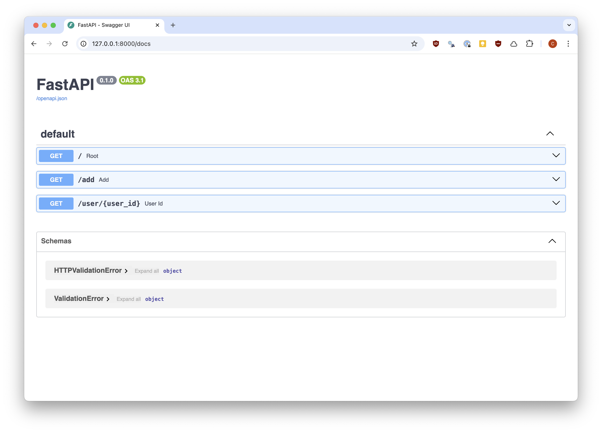
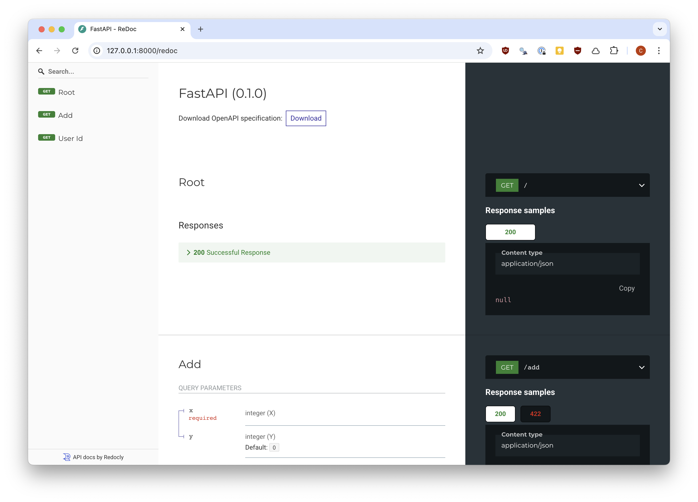
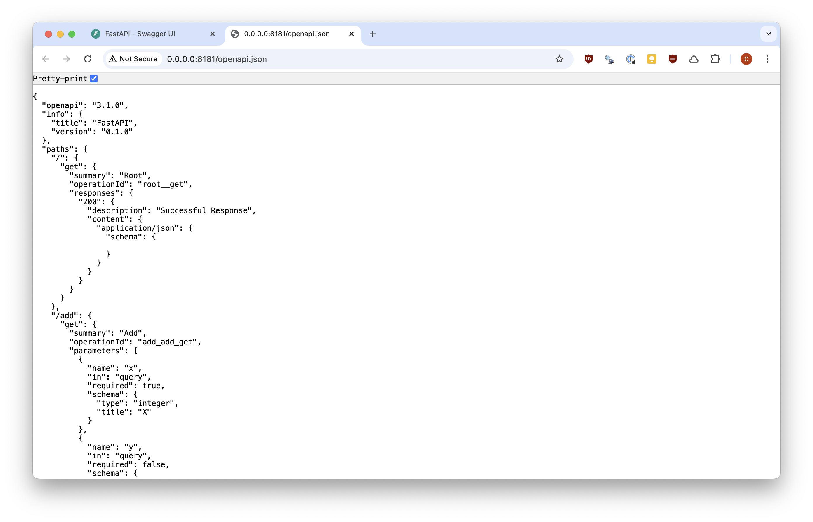

```{r setup, message=FALSE, warning=FALSE, include=FALSE}

```

```{python}
#| include: false
from pprint import pprint
```

```{css}
/*| include: false
.reveal pre code {
  text-wrap-mode: nowrap !important;
  max-height: 520px !important;
}
```

```{css}
/*| include: false
pre.shell > code > span > a::before {
  content: ">" !important;
  color: #aaaaaa;
}
```

## FastAPI - Basic Example

::: {.small}
::: {.code-file .sourceCode .cell-code}
&nbsp;&nbsp; `r fontawesome::fa("file")` &nbsp; `ex1/app.py`
:::
```{python}
#| file: Lec17/ex1/app.py
#| eval: false
```
:::

## Defining endpoints

Similar to plumber, FastAPI transforms basic Python functions into API endpoints, which are made available by a Python-based webserver (uvicorn).

This transformation is performed using [decorators](https://peps.python.org/pep-0318/) that are used to specify the endpoints via a url path and http method.

For example,

```python
@app.get("/")
async def root():
    return {"message": "Hello World"}
```

Creates an endpoint at `/` that responds to http GET requests with the json `{"message": "Hello World"}`.


## Running a FastAPI app

There are a couple of options for running your app,

* Running from Python using uvicorn (an HTTP server based on uv):

  ::: {.xsmall}
  ```python
  uvicorn.run(app, host="0.0.0.0", port=8181)
  ```
  ```
  INFO:     Started server process [84680]
  INFO:     Waiting for application startup.
  INFO:     Application startup complete.
  INFO:     Uvicorn running on http://0.0.0.0:8181 (Press CTRL+C to quit)
  ```
  :::
  
* Running from the command line using uvicorn

  ::: {.xsmall}
  ```shell
  uvicorn ex1.app:app --host 0.0.0.0 --port 8080
  ```
  ```
  INFO:     Started server process [99168]
  INFO:     Waiting for application startup.
  INFO:     Application startup complete.
  INFO:     Uvicorn running on http://0.0.0.0:8080 (Press CTRL+C to quit)
  ```
  :::
  
## {.scrollable}
* Running from the shell using fastapi (you may need to run `uv add 'fastapi[standard]'` for this to work)
  
  ::: {.xxsmall}
  ```shell
  fastapi run ex1/app.py
  ```
  ```
   FastAPI   Starting production server 🚀
 
             Searching for package file structure from directories with __init__.py files
             Importing from /Users/rundel/Desktop/Sta663-Sp26/website/static/slides/Lec17/ex1
 
    module   🐍 app.py
 
      code   Importing the FastAPI app object from the module with the following code:
 
             from app import app
 
       app   Using import string: app:app
 
    server   Server started at http://0.0.0.0:8000
    server   Documentation at http://0.0.0.0:8000/docs
 
             Logs:
 
      INFO   Started server process [99526]
      INFO   Waiting for application startup.
      INFO   Application startup complete.
      INFO   Uvicorn running on http://0.0.0.0:8000 (Press CTRL+C to quit)
  ```
  :::
  

Both `run` and `dev` commands are available. The primary difference is the latter has auto-reload enabled which restarts the server when the underlying code changes. `dev` also binds `127.0.0.1` by default while `run` binds `0.0.0.0`.


## API Docs

::: {.panel-tabset}

### `/docs`

{width=66% fig-align=center}

### `/redoc`

{width=66% fig-align=center}

### `/openapi.json`

{width=75% fig-align=center}

:::


## Basic Example (again)

::: {.small}
::: {.code-file .sourceCode .cell-code}
&nbsp;&nbsp; `r fontawesome::fa("file")` &nbsp; `ex1/app.py`
:::
```{python}
#| file: Lec17/ex1/app.py
#| eval: false
```
:::

## `async`?

You may have noticed that all of the function definitions make use of `async def f(...)` - this allows FastAPI to execute these functions asynchronously.

If you don't know what this is generally you don't need to worry about it, but some general advice is:

* If you are using a third-party library that tells you to make calls using the `await` keyword then you definitely need `async`.

* If your function, or a library your function uses, communicates with something (e.g. a database, an API, the file system, etc.) and *does not* support `await`, then don't use `async`.

* If neither of the above apply, generally you should default to using `async` (as long as you avoid blocking calls inside the function).


::: {.aside}
If you want to know more you can read more about it in FastAPI's [Concurrency and async / await](https://fastapi.tiangolo.com/async/) docs
:::


## Query parameters

Like plumber, endpoint functions' arguments are interpreted as query parameters. All arguments without defaults are assumed to be required.


::: {.columns .xsmall}
::: {.column}

```python
import requests
url = "http://0.0.0.0:8000"
```

```python
requests.get(url+"/add?x=1&y=1").json()
```
```
{'result': 2}
```

```python
requests.get(url+"/add?x=-7&y=12").json()
```
```
{'result': 5}
```

```python
requests.get(url+"/add?x=-7").json()
```
```
{'result': -7}
```

:::
::: {.column .fragment}

```python
r = requests.get(url+"/add?y=-7")
r.status_code
```
```
422
```

```python
pprint( r.json() )
```
```
{'detail': 
  [{
    'type': 'missing', 
    'loc': ['query', 'x'], 
    'msg': 'Field required', 
    'input': None
  }]
}
```

:::
:::


## Type hinting

If type hinting is used when defining your function then FastAPI will attempt to validate the user's inputs based on those types.

:::: {.columns .xxsmall}
::: {.column width='50%'}

```python
r = requests.get(url+"/add?x=1.0&y=2.0")
r.status_code
```
```
200
```

```python
r.json()
```
```
{'result': 3}
```

```python
r = requests.get(url+"/add?x=abc&y=1")
r.status_code
```
```
422
```

```python
r.json()
```
```
{'detail': 
  [{
    'type': 'int_parsing', 
    'loc': ['query', 'x'], 
    'msg': 'Input should be a valid integer, unable to parse string as an integer', 
    'input': 'abc'
  }]
}
```


:::

::: {.column width='50%' .fragment}

```python
r = requests.get(url+"/add?x=1.5&y=2.")
r.status_code
```
```
422
```

```python
r.json()
```
```
{'detail': 
  [{
    'type': 'int_parsing', 
    'loc': ['query', 'x'], 
    'msg': 'Input should be a valid integer, unable to parse string as an integer',
    'input': '1.5'
  }, {
    'type': 'int_parsing', 
    'loc': ['query', 'y'], 
    'msg': 'Input should be a valid integer, unable to parse string as an integer', 
    'input': '2.'
  }]
}
```
:::
::::

::: {.aside}
More advanced data validation is possible through the use of `typing` and `pydantic` - see [here](https://fastapi.tiangolo.com/tutorial/query-params-str-validations/), [here](https://fastapi.tiangolo.com/tutorial/path-params-numeric-validations/), and [here](https://fastapi.tiangolo.com/tutorial/query-param-models/) for details.
:::


## Path parameters

Again, like plumber, arguments can be passed to the API using the request path - these are indicated using `{}` in the path definition and then having a matching argument name in the function definition.

:::: {.columns .xsmall}
::: {.column width='50%'}

```python
r = requests.get(url+"/user/1234?name=Colin")
r.status_code
```
```
200
```

```python
r.json()
```
```
{'user_id': 1234, 'name': 'Colin'}
```

```python
r = requests.get(url+"/user/3141")
r.status_code
```
```
200
```

```python
r.json()
```
```
{'user_id': 3141}
```
:::

::: {.column width='50%'}
```python
r = requests.get(url+"/user/Colin")
r.status_code
```
```
422
```

```python
r.json()
```
```
{'detail': 
  [{
    'type': 'int_parsing', 
    'loc': ['path', 'user_id'], 
    'msg': 'Input should be a valid integer, unable to parse string as an integer', 
    'input': 'Colin'
  }]
}
```
:::
::::


::: {.aside}
The use of `name: str | None = None` allows for the name query parameter to be optional with this endpoint
:::


## HTTP Methods

The HTTP method used in the decorator determines the type of operation the endpoint performs. REST conventions suggest:

::: {.small}
| Method | Purpose | Decorator |
|--------|---------|-----------|
| `GET` | Retrieve data | `@app.get()` |
| `POST` | Create a new resource | `@app.post()` |
| `PUT` | Replace a resource entirely | `@app.put()` |
| `PATCH` | Partially update a resource | `@app.patch()` |
| `DELETE` | Remove a resource | `@app.delete()` |
:::

Query and path parameters are most natural with `GET` and `DELETE`. 

`POST`, `PUT`, and `PATCH` typically receive data via a request body.


## Request body

When making `PUT`, `POST`, or `PATCH` requests, we are usually sending data to the API via the body of our request.

FastAPI makes use of `pydantic` models to define the expected body content. I would like to avoid getting into the weeds of `pydantic` and `typing` as much as possible, so we will go with the most basic use case.

The following `pydantic` model specifies an expected body that contains `name` and `price` entries that are a string and float respectively, and optionally a `description` string and `tax` float.

::: {.xsmall}
```python
from pydantic import BaseModel

class Item(BaseModel):
    name: str
    description: str | None = None
    price: float
    tax: float | None = None
```
:::

## Usage

The preceding data model can be used as an argument for our endpoint function, and FastAPI will take care of processing everything for us.

::: {.xsmall}
```python
items = []

@app.post("/items")
async def add_item(item: Item):
    items.append(item)
    return items
```
:::

## Usage - Demo

::: {.xsmall}
```python
requests.post(url+"/items", json={"name": "Widget", "price": 9.99}).json()
```
```
[{'name': 'Widget', 'description': None, 'price': 9.99, 'tax': None}]
```

```python
requests.post(url+"/items", json={"name": "Gadget", "price": 4.99, "description": "A useful gadget", "tax": 0.25}).json()
```
```
[{'name': 'Widget', 'description': None, 'price': 9.99, 'tax': None},
 {'name': 'Gadget', 'description': 'A useful gadget', 'price': 4.99, 'tax': 0.25}]
```
:::

. . .

::: {.xsmall}
```python
r = requests.post(url+"/items", json={"name": "Widget"})
r.status_code
```
```
422
```

```python
pprint(r.json())
```
```
{'detail':
  [{
    'type': 'missing',
    'loc': ['body', 'price'],
    'msg': 'Field required',
    'input': {'name': 'Widget'}
  }]
}
```
:::


## What's happening?

From FastAPI's [Request body docs](https://fastapi.tiangolo.com/tutorial/body/#results):

::: {.small}
> With just that Python type declaration, FastAPI will:
>
> * Read the body of the request as JSON.
>
> * Convert the corresponding types (if needed).
>
> * Validate the data.
>   * If the data is invalid, it will return a nice and clear error, indicating exactly where and what was the incorrect data.
>
> * Give you the received data in the parameter item.
>   * As you declared it in the function to be of type Item, you will also have all the editor support (completion, etc) for all of the attributes and their types.
>
> * Generate [JSON Schema](https://json-schema.org/) definitions for your model, you can also use them anywhere else you like if it makes sense for your project.
>
> * Those schemas will be part of the generated OpenAPI schema, and used by the automatic documentation UIs.
:::


## Body vs path & query parameters

Endpoints can use any mixture of body, path, and query parameters. 

FastAPI uses the following rules to determine what each argument is:

> The function parameters will be recognized as follows:
>
> * If the parameter is also declared in the path, it will be used as a path parameter.
>
> * If the parameter is of a singular type (like `int`, `float`, `str`, `bool`, etc) it will be interpreted as a query parameter.
>
> * If the parameter is declared to be of the type of a Pydantic model, it will be interpreted as a request body.


## Error handling - `HTTPException`

For intentional errors (e.g. a requested resource not found), FastAPI provides `HTTPException`:

::: {.xsmall}
```python
from fastapi import HTTPException

@app.get("/items/{item_id}")
async def get_item(item_id: int):
    if item_id >= len(items):
        raise HTTPException(status_code=404, detail="Item not found")
    return items[item_id]
```
:::

. . .

:::: {.columns .xsmall}
::: {.column width='50%'}
```python
requests.get(url+"/items/0").json()
```
```
{'name': 'Widget', 'description': None,
 'price': 9.99, 'tax': None}
```
:::

::: {.column width='50%'}
```python
r = requests.get(url+"/items/99")
r.status_code
```
```
404
```

```python
r.json()
```
```
{'detail': 'Item not found'}
```
:::
::::


## FastAPI vs plumber

:::: {.columns}
::: {.column width='50%'}

plumber (R)

::: {.xsmall}
```r
#* @get /add
function(x, y = 0) {
  list(
    result = as.integer(x) + as.integer(y)
  )
}

#* @post /items
function(req) {
  item <- jsonlite::fromJSON(req$postBody)
  items[[length(items)+1]] <<- item
  items
}

#* @get /items/<item_id:int>
function(item_id) {
  if (item_id > length(items))
    stop("Item not found")
  items[[item_id]]
}
```
:::
:::

::: {.column width='50%'}

FastAPI (Python)

::: {.xsmall}
```python
@app.get("/add")
async def add(x: int, y: int = 0):
    return {"result": x + y}

@app.post("/items/")
async def add_item(item: Item):
    items.append(item)
    return items

@app.get("/items/{item_id}")
async def get_item(item_id: int):
    if item_id >= len(items):
        raise HTTPException(404, "Item not found")
    return items[item_id]
```
:::
:::
::::


# Example 2 - A model API

## FastAPI - A model API

::: {.small}
::: {.code-file .sourceCode .cell-code}
&nbsp;&nbsp; `r fontawesome::fa("file")` &nbsp; `ex2/app.py`
:::
```{python}
#| file: Lec17/ex2/app.py
#| eval: false
```
:::

## Fitting the model

::: {.xsmall}
```python
rng = np.random.default_rng(seed=1234)
n = 100
X = rng.normal(size=(n, 5))
b = np.array([5, 0, 0, 3, -2]).reshape(-1, 1)
y = (X @ b).squeeze() + rng.normal(scale=0.5, size=n)
```

```python
r = requests.post(url+"/fit", json={"X": X.tolist(), "y": y.tolist()})
r.status_code
```
```
200
```

```python
pprint(r.json())
```
```
{'intercept': 0.028,
 'coef': [4.988, 0.051, -0.032, 3.015, -1.993]}
```
:::

## Predicting from the model

::: {.xsmall}
```python
r = requests.post(url+"/predict", json={"X": X.tolist()})
r.status_code
```
```
200
```

```python
pprint(r.json()["y_hat"][:5])
```
```
[7.432, -2.145, 3.218, 11.876, -5.003]
```
:::

. . .

::: {.xsmall}
```python
pprint( requests.get(url+"/coefs").json() )
```
```
{'intercept': 0.028,
 'coef': [4.988, 0.051, -0.032, 3.015, -1.993]}
```
:::

## Returning a figure - `StreamingResponse`

Rather than JSON, FastAPI can return raw binary data using `StreamingResponse` (or other `Response` subclasses).

The key pattern for returning an in-memory figure:

::: {.xsmall}
```python
buf = io.BytesIO()        # in-memory binary buffer
fig.savefig(buf, format="png")
buf.seek(0)               # rewind buffer
plt.close(fig)            # free memory

return StreamingResponse(buf, media_type="image/png")
```
:::

The `media_type` tells the client how to interpret the bytes — a browser or Python client receiving `image/png` knows to render it as an image rather than text.

::: {.aside}
`matplotlib.use("Agg")` is set before importing `pyplot` on the server to select a *non-interactive* backend (no display required).
:::

## Residuals plot

::: {.xsmall}
```python
r = requests.get(url+"/plot")
r.status_code
```
```
200
```

```python
r.headers["content-type"]
```
```
'image/png'
```

```python
from IPython.display import Image
Image(r.content)
```
:::

```{python}
#| echo: false
#| fig-align: center
#| fig-width: 5
#| fig-height: 3.5
import matplotlib.pyplot as plt
import numpy as np
from sklearn.linear_model import LinearRegression

rng = np.random.default_rng(seed=1234)
n = 100
X = rng.normal(size=(n, 5))
b = np.array([5, 0, 0, 3, -2]).reshape(-1, 1)
y = (X @ b).squeeze() + rng.normal(scale=0.5, size=n)

lm = LinearRegression().fit(X, y)

y_hat = lm.predict(X)
resid  = y - y_hat

fig, ax = plt.subplots()
ax.scatter(y_hat, resid, alpha=0.6)
ax.axhline(0, color="red", linewidth=1, linestyle="--")
ax.set_xlabel("Fitted values")
ax.set_ylabel("Residuals")
ax.set_title("Residuals vs Fitted")
fig.tight_layout()
plt.show()
```
