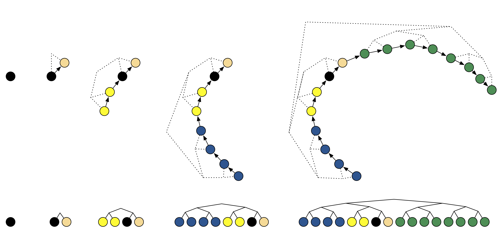

```{r setup, message=FALSE, warning=FALSE, include=FALSE}

```

```{python}
#| include: false

import numpy as np
import matplotlib as mpl
import matplotlib.pyplot as plt
import pandas as pd
import seaborn as sns
import scipy

import patsy

import pymc as pm
import arviz as az
import xarray as xr
xr.set_options(display_style="text")

import os
os.environ["COLUMNS"] = "110"

plt.rcParams['figure.dpi'] = 200

np.set_printoptions(
  edgeitems=30, linewidth=200,
  precision = 5, suppress=True
)

pd.set_option("display.width", 150)
pd.set_option("display.max_columns", 10)
pd.set_option("display.precision", 6)
```

```{python helpers}
#| include: false
def offset(l, shift=False):
  res = [x for x in l for _ in range(2)]
  if shift:
    res = [res[0]] + res[:-1]
  return res

def mh_trajectories(trace, colors = ["magenta","green","orange","blue"], use_offset=True, chains = None):
  
  n = trace.posterior.sizes.get("chain",1)
  if chains is None:
    chains = range(n)

  for i in chains:
    x = trace.posterior["x1"].sel(chain=i).values
    y = trace.posterior["x2"].sel(chain=i).values
    if use_offset:
      x = offset( x )
      y = offset( y, True)

    plt.plot(
      x, y,
      "-o", c=colors[i], #linewidth=0.5, markersize=0.75,
      label=f"Chain {i}", alpha=0.5
    )
  
  plt.legend()

def mh_trace(trace, colors = ["magenta","green","orange","blue"], chains = None):

  n = trace.posterior.sizes.get("chain",1)
  if chains is None:
    chains = range(n)

  fig, (ax1, ax2) = plt.subplots(2, 1, layout="constrained")

  for i in chains:
    x1 = trace.posterior["x1"].sel(chain=i).values
    x2 = trace.posterior["x2"].sel(chain=i).values
    draws = range(len(x1))

    ax1.plot(draws, x1, "-", c=colors[i], alpha=0.5)
    ax2.plot(draws, x2, "-", c=colors[i], alpha=0.5)

  ax1.set_ylabel("x1")
  ax2.set_ylabel("x2")
  ax2.set_xlabel("Draw")

```


## Gibbs Sampler

The Gibbs sampler is an MCMC algorithm for drawing samples from a multivariate
distribution by breaking it into a sequence of simpler 1D (or lower-dimensional) sampling problems.

Rather than sampling all parameters simultaneously, we cycle through
each parameter one at a time (or in blocks), drawing from their distribution *conditional on the
current values of all other parameters*.

Algorithm:

1. Start with an initial guess for all parameters
2. Pick a parameter and sample a new value for it, holding all others fixed
3. Repeat for every other parameter (one full cycle = one iteration)
4. Repeat iterations until the chain converges


## Effective Sample Size (ESS)

::: {.medium}
Because consecutive MCMC draws are correlated, $N$ draws are worth fewer than $N$ independent samples. 

ESS quantifies this:

$$\text{ESS} = \frac{N}{1 + 2\sum_{t=1}^{\infty} \rho_t}$$

where $\rho_t$ is the autocorrelation at lag $t$. The denominator ($\tau$) is the integrated autocorrelation time — the effective number of draws needed to produce one independent sample.

- If draws are independent ($\rho_t = 0$ for all $t > 0$) then $\text{ESS} = N$
- High autocorrelation $\Rightarrow$ large $\tau$ $\Rightarrow$ small ESS
:::

::: {.aside}
In practice we estimate $\rho_t$ from the MCMC samples and truncate the sum at some lag where $\rho_t$ becomes small.
:::


# Example 1 <br/> Banana Distribution

## Banana Distribution

::: {.xsmall}
```{python}
# Data
n = 100
x1_mu = .75
x2_mu = .75
y = pm.draw(pm.Normal.dist(mu=x1_mu+x2_mu**2, sigma=1, shape=n))

# Model
with pm.Model() as banana:
  x1 = pm.Normal("x1", mu=0, sigma=1)
  x2 = pm.Normal("x2", mu=0, sigma=1)

  y = pm.Normal("y", mu=x1+x2**2, sigma=1, observed=y)

```
:::

## Joint posterior of x1 & x2

```{python}
#| echo: false

with banana:
  trace = pm.sample(draws=100000, chains=1, random_seed=1234, progressbar=False)
```

```{python}
#| echo: false
plt.figure(layout="constrained")
sns.kdeplot(
  trace.posterior.to_dataframe(), 
  x="x1", y="x2", fill=True
)
plt.show()
```


# Metropolis-Hastings

## MH Algorithm

::: {.medium}
For a parameter of interest start with an initial value $\theta_0$ then for the next sample ($t+1$),

1. Generate a proposal value $\theta'$ from a proposal distribution $q(\theta'|\theta_t)$.

2. Calculate the acceptance probability,
   $$
   \alpha = \text{min}\left(1, \frac{P(\theta'|x)}{P(\theta_t|x)} \frac{q(\theta_t|\theta')}{q(\theta'|\theta_t)}\right)
   $$

   where $P(\theta|x)$ is the target posterior distribution.

3. Accept proposal $\theta'$ with probability $\alpha$, if accepted $\theta_{t+1} = \theta'$ else $\theta_{t+1} = \theta_t$.
:::

. . .

::: {.medium}
Some considerations:

* Choice of the proposal distribution matters a lot

* Results are for the limit as $t \to \infty$

* Concerns are around efficiency (ess / s)
:::


## Metropolis-Hastings Sampler

::: {.panel-tabset}

### Model

::: {.small}
```{python}
#| code-line-numbers: "|4|3"
with banana:
  mh = pm.sample(
    draws=100, tune=0,
    step=pm.Metropolis([x1,x2]),
    random_seed=1234
  )
```
```{python}
az.summary(mh)
```
:::


### Traces

```{python}
#| echo: false
mh_trace(mh)
plt.show()
```

### ACF

```{python}
#| echo: false
#| out-width: "100%"
ax = az.plot_autocorr(mh, max_lag=25, figsize=(10,6))
plt.gcf().set_layout_engine("constrained")
plt.show()
```

### Trajectories

```{python}
#| echo: false

plt.figure(layout="constrained")
sns.kdeplot(
  trace.posterior.to_dataframe(), 
  x="x1", y="x2", fill=True
)

mh_trajectories(mh, use_offset=False)

plt.show()
```
:::


## MH with Tuning (burnin + adaptation)

::: {.panel-tabset}

### Model

::: {.xsmall}
```{python}
#| code-line-numbers: "|3"
with banana:
  mht = pm.sample(
    draws=100, tune=1000,
    step=pm.Metropolis([x1,x2]),
    random_seed=1234
  )
```
```{python}
az.summary(mht)
```
:::

### Traces

```{python}
#| echo: false
mh_trace(mht)
plt.show()
```

### ACF

```{python}
#| echo: false
ax = az.plot_autocorr(mht, max_lag=25, figsize=(10,6))
plt.gcf().set_layout_engine("constrained")
plt.show()
```

### Trajectories

```{python}
#| echo: false

plt.figure(layout="constrained")
sns.kdeplot(
  trace.posterior.to_dataframe(),
  x="x1", y="x2", fill=True
)

mh_trajectories(mht, use_offset=False)

plt.show()
```
:::


## Effects of tuning / burn-in

There are two confounded effects from letting the sampler tune / burn-in:

1. We have let the sampler run for 1000 iterations - this gives it a chance to find the areas of higher density and settle in.

   This also makes each chain less sensitive to their initial starting position.

2. We have also tuned the size of the MH proposals to achieve a better acceptance rate(s) - this lets the chains better explore the target distribution.
   
   PyMC uses an adaptive algorithm to adjust the proposal size during the tuning phase to achieve an acceptance rate between 0.2 and 0.5.

## More samples?

::: {.panel-tabset}

### Model

::: {.xsmall}
```{python}
with banana:
  mh_more = pm.sample(
    draws=1000, tune=1000,
    step=pm.Metropolis([x1,x2]),
    random_seed=1234
  ).sel(
    draw=slice(None,None,10)
  )
```
```{python}
az.summary(mh_more)
```
:::

### Traces

```{python}
#| echo: false
mh_trace(mh_more)
plt.show()
```

### ACF

```{python}
#| echo: false
ax = az.plot_autocorr(mh_more, max_lag=25, figsize=(10,6))
plt.gcf().set_layout_engine("constrained")
plt.show()
```

### Trajectories

```{python}
#| echo: false

plt.figure(layout="constrained")
sns.kdeplot(
  trace.posterior.to_dataframe(),
  x="x1", y="x2", fill=True
)

mh_trajectories(mh_more)

plt.show()
```
:::

## Even more samples?

::: {.panel-tabset}

### Model

::: {.xsmall}
```{python}
with banana:
  mh_more2 = pm.sample(
    draws=10000, tune=1000,
    step=pm.Metropolis([x1,x2]),
    random_seed=1234
  ).sel(
    draw=slice(None,None,100)
  )
```
```{python}
az.summary(mh_more2)
```
:::

### Traces

```{python}
#| echo: false
mh_trace(mh_more2)
plt.show()
```

### ACF

```{python}
#| echo: false
ax = az.plot_autocorr(mh_more2, max_lag=25, figsize=(10,6))
plt.gcf().set_layout_engine("constrained")
plt.show()
```

### Trajectories

```{python}
#| echo: false

plt.figure(layout="constrained")
sns.kdeplot(
  trace.posterior.to_dataframe(),
  x="x1", y="x2", fill=True
)

mh_trajectories(mh_more2)

plt.show()
```
:::


# Slice Sampling

## Slice Algorithm


Given a current value $\theta_t$, each iteration proceeds as:

::: {.columns .medium}
::: {.column width=60%}
1. Draw a "height" uniformly below the current density

2. Define the "slice" — the level set at height $u$
3. Draw the next sample uniformly from the slice
:::
::: {.column width=40%}
- $u \sim \text{Uniform}\!\left(0,\, p(\theta_t \mid x)\right)$

- $S = \{\theta : p(\theta \mid x) \geq u\}$

- $\theta_{t+1} \sim \text{Uniform}(S)$
:::
:::

:::

. . .

In practice, finding $S$ exactly is rarely feasible, so a **stepping-out / shrinkage** procedure is used: bracket $\theta_t$ with an interval, expand it until both ends are outside the slice, then shrink inward whenever a proposed draw is rejected.


## Animation

::: {.center}
{width=75%}
:::

::: {.aside}
Based on [Back to Basics with David MacKay #4](https://sidravi1.github.io/blog/2019/06/21/hmc-and-slice-sampler)
:::

## Slice Samples


::: {.panel-tabset}

### Model

::: {.xsmall}
```{python}
with banana:
  sl = pm.sample(
    draws=100, tune=1000,
    step=pm.Slice([x1, x2]),
    random_seed=1234
  )
```
```{python}
az.summary(sl)
```
:::

### Traces

```{python}
#| echo: false
mh_trace(sl)
plt.show()
```

### ACF

```{python}
#| echo: false
ax = az.plot_autocorr(sl, max_lag=25, figsize=(10,6))
plt.gcf().set_layout_engine("constrained")
plt.show()
```

### Trajectories

```{python}
#| echo: false
plt.figure(layout="constrained")
sns.kdeplot(
  trace.posterior.to_dataframe(),
  x="x1", y="x2", fill=True
)

mh_trajectories(sl)

plt.show()
```
:::


## More Slice Samples

::: {.panel-tabset}

### Model

::: {.xsmall}
```{python}
with banana:
  sl_more = pm.sample(
    draws=1000, tune=1000,
    step=pm.Slice([x1, x2]),
    random_seed=1234
  ).sel(
    draw=slice(None,None,10)
  )
```
```{python}
az.summary(sl_more)
```
:::

### Traces

```{python}
#| echo: false
mh_trace(sl_more)
plt.show()
```

### ACF

```{python}
#| echo: false
ax = az.plot_autocorr(sl_more, max_lag=25, figsize=(10,6))
plt.gcf().set_layout_engine("constrained")
plt.show()
```

### Trajectories

```{python}
#| echo: false
plt.figure(layout="constrained")
sns.kdeplot(
  trace.posterior.to_dataframe(),
  x="x1", y="x2", fill=True
)

mh_trajectories(sl_more)

plt.show()
```
:::


# Hamiltonian Samplers

## Background

::: {.medium}
Hamiltonian Monte Carlo (HMC) conceptualizes the model parameters as a particle moving through the posterior landscape. These particles have a position ($\theta$) and an auxiliary momentum ($\rho$), and their joint dynamics are governed by the **Hamiltonian**:

$$
H(\theta, \rho) = V(\theta) + T(\rho \mid \theta)
$$

$$
\underbrace{V(\theta)}_{\text{potential energy}} = -\log p(\theta \mid x),
$$
$$
\underbrace{T(\rho \mid \theta)}_{\text{kinetic energy}} = -\log p(\rho \mid \theta)
$$

In most applications of HMC, the auxiliary density is a multivariate normal that does not depend on the parameters, $\rho \sim \mathcal{N}(0, M)$.


:::

::: {.aside}
See Stan’s discussion [here](https://mc-stan.org/docs/reference-manual/mcmc.html#the-hamiltonian)
:::

## Hamiltonian dynamics

::: {.medium}
Given this setup Hamilton’s equations of motion give a set of PDEs governing the particle’s trajectory. 

$$\frac{d\theta}{dt} = \frac{\partial H}{\partial \rho} = \frac{\partial }{\partial \rho} -\log p(\rho \mid \theta)$$

$$\frac{d\rho}{dt} = -\frac{\partial H}{\partial \theta} = \nabla_\theta \log p(\theta \mid x)$$

The first equation implies that position changes in the direction of the momentum. 

The second implies momentum is accelerated by the gradient of the log-posterior — high-density regions attract the particle.

Along any exact trajectory $H(\theta, \rho)$ is conserved, meaning the particle moves without changing its total energy. 
:::

## Leapfrog Integrator

::: {.medium}
The dynamics are solved numerically using the leapfrog integrator.

Starting from $(\theta_t, \rho_t)$, each leapfrog step of size $\epsilon$ proceeds as:

$$
\begin{aligned}
\rho_{t+1/2} &= \rho_t + \frac{\epsilon}{2}\nabla \log p(\theta_t \mid x) \\
\theta_{t+1}  &= \theta_t + \epsilon\, M^{-1} \rho_{t+1/2} \\
\rho_{t+1}   &= \rho_{t+1/2} + \frac{\epsilon}{2}\nabla \log p(\theta_{t+1} \mid x)
\end{aligned}
$$

This is repeated $L$ times to produce a proposed $(\theta’, \rho’)$. A Metropolis acceptance step is then used to correct for any numerical error by accepting the proposed move with probability
$$\alpha = \min\!\left(1,\, \exp\bigl(H(\theta, \rho) - H(\theta’, \rho’)\bigr)\right)$$

If the integrator were exact, $H$ would be conserved and $\alpha = 1$ always — the MH step only corrects for numerical error, so acceptance rates are typically very high.
:::

## HMC Algorithm

::: {.medium}
For the current parameter value $\theta_t$:

1. Sample a momentum $\rho \sim \mathcal{N}(0, M)$

2. Run $L$ leapfrog steps of size $\epsilon$ to obtain a proposal $(\theta’, \rho’)$

3. Accept $\theta’$ with probability
$$ \alpha = \min\!\left(1,\, \exp\bigl(H(\theta_t, \rho) - H(\theta’, \rho’)\bigr)\right) $$

The new momentum draw at step 1 randomizes the direction of travel each iteration, ensuring the chain is ergodic.
:::

## Algorithm parameters

::: {.medium}
* **$\epsilon$ (step size)** — controls the size of each leapfrog step. 
  Too large $\Rightarrow$ large numerical error, low acceptance rate; too small $\Rightarrow$ fine-grained but slow exploration.

* **$M$ (mass matrix)** — acts as a preconditioning matrix. 
  A diagonal $M$ rescales parameters with different variances; a full $M$ also accounts for correlations.

* **$L$ (number of leapfrog steps)** — controls how far the particle travels each iteration. 
  Too few $\Rightarrow$ short trajectories; too many $\Rightarrow$ the trajectory can curve back on itself (a "U-turn"), wasting computation without improving exploration.

All three are tuned automatically during warmup, but $L$ is particularly difficult to tune.
:::


## HamiltonianMC

::: {.panel-tabset}

### Model

::: {.xsmall}
```{python}
#| code-line-numbers: "|4"
with banana:
  hmc = pm.sample(
    draws=100, tune=1000,
    step=pm.HamiltonianMC([x1,x2]),
    random_seed=1234
  )
```
```{python}
az.summary(hmc)
```
:::

### Traces

```{python}
#| echo: false
mh_trace(hmc)
plt.show()
```

### ACF

```{python}
#| echo: false
ax = az.plot_autocorr(hmc, max_lag=25, figsize=(10,6))
plt.gcf().set_layout_engine("constrained")
plt.show()
```

### Trajectories

```{python}
#| echo: false

plt.figure(layout="constrained")
sns.kdeplot(
  trace.posterior.to_dataframe(),
  x="x1", y="x2", fill=True
)

mh_trajectories(hmc, use_offset=False)

plt.show()
```
:::

## More HamiltonianMC

::: {.panel-tabset}

### Model

::: {.xsmall}
```{python}
with banana:
  hmc_more = pm.sample(
    draws=1000, tune=1000,
    step=pm.HamiltonianMC([x1,x2]),
    random_seed=1234
  ).sel(
    draw=slice(None,None,10)
  )
```
```{python}
az.summary(hmc_more)
```
:::

### Traces

```{python}
#| echo: false
mh_trace(hmc_more)
plt.show()
```

### ACF

```{python}
#| echo: false
ax = az.plot_autocorr(hmc_more, max_lag=25, figsize=(10,6))
plt.gcf().set_layout_engine("constrained")
plt.show()
```

### Trajectories

```{python}
#| echo: false

plt.figure(layout="constrained")
sns.kdeplot(
  trace.posterior.to_dataframe(),
  x="x1", y="x2", fill=True
)

mh_trajectories(hmc_more, use_offset=False)

plt.show()
```
:::

## No-U-turn sampler (NUTS)

::: {.medium}
This is a variation of Hamiltonian Monte Carlo that automatically tunes the number of leapfrog steps to allow more effective exploration of the parameter space.

Specifically, it uses a tree based algorithm that tracks trajectories forwards and backwards in time. The tree expands until a maximum depth is achieved or a "U-turn" is detected.

{width=55% fig-align="center"}

NUTS also does not use a metropolis step to select the final parameter value, instead the sample is chosen among the valid candidates along the trajectory.
:::

::: {.aside}
Figure from Hoffman and Gelman, 2014
:::


## NUTS

::: {.panel-tabset}

### Model

::: {.xsmall}
```{python}
#| code-line-numbers: "|4"
with banana:
  nuts = pm.sample(
    draws=100, tune=1000,
    step=pm.NUTS([x1,x2]),
    random_seed=1234
  )
```
```{python}
az.summary(nuts)
```
:::

### Traces

```{python}
#| echo: false
mh_trace(nuts)
plt.show()
```

### ACF

```{python}
#| echo: false
ax = az.plot_autocorr(nuts, max_lag=25, figsize=(10,6))
plt.gcf().set_layout_engine("constrained")
plt.show()
```

### Trajectories

```{python}
#| echo: false

plt.figure(layout="constrained")
sns.kdeplot(
  trace.posterior.to_dataframe(),
  x="x1", y="x2", fill=True
)

mh_trajectories(nuts, use_offset=False)

plt.show()
```
:::


## More NUTS

::: {.panel-tabset}

### Model

::: {.xsmall}
```{python}
with banana:
  nuts_more = pm.sample(
    draws=1000, tune=1000,
    step=pm.NUTS([x1,x2]),
    random_seed=1234
  ).sel(
    draw=slice(None,None,10)
  )
```
```{python}
az.summary(nuts_more)
```
:::

### Traces

```{python}
#| echo: false
mh_trace(nuts_more)
plt.show()
```

### ACF

```{python}
#| echo: false
ax = az.plot_autocorr(nuts_more, max_lag=25, figsize=(10,6))
plt.gcf().set_layout_engine("constrained")
plt.show()
```

### Trajectories

```{python}
#| echo: false

plt.figure(layout="constrained")
sns.kdeplot(
  trace.posterior.to_dataframe(),
  x="x1", y="x2", fill=True
)

mh_trajectories(nuts_more, use_offset=False)

plt.show()
```
:::

## Some considerations

* Hamiltonian MC methods are all very sensitive to the choice of their tuning parameters (NUTS less so, but adds additional parameters)

* Hamiltonian MC methods require the gradient of the log density of the parameter(s) of interest for the leapfrog integrator - *this limits this method to continuous parameters*

* HMC updates are generally more expensive computationally than MH updates, but they also tend to produce chains with lower autocorrelation. Think about performance in terms of *effective samples per unit of time*.


## Divergent transitions

Using Stan or PyMC with NUTS you will often see messages / warnings about divergent transitions or divergences.

This is based on the assumption of conservation of energy with regard to the Hamiltonian system - $H(\theta, \rho)$ should remain constant for the "particle" along its trajectory. 

When the $H(\theta, \rho)$ resulting from the leapfrog integrator differs from the initial value then a divergence is considered to have occurred.

* The proximate cause of this is a breakdown of the first-order approximations in the leapfrog algorithm.

* The ultimate cause is usually a highly curved posterior or a posterior where the rate of curvature is changing rapidly.

## Solutions?

Very much depend on the nature of the problem - typically we can reparameterize the model and/or adjust some of the tuning parameters to help the sampler deal with the problematic posterior.

For the latter the following options can be passed to `pm.sample()` or `pm.NUTS()`:

* `target_accept` - step size is adjusted to achieve the desired acceptance rate (larger values result in smaller steps which often work better for problematic posteriors). Default value is 0.8, increase for smaller steps and fewer divergences, decrease for larger steps and more exploration.

* `max_treedepth` - maximum depth of the trajectory tree. Default value is 10, increase for deeper exploration, decrease for faster sampling.

* `step_scale` - the initial guess for the step size before warmup adaptation. Default value is 0.25 which is further scaled based on dimensionality.


## NUTS (adjusted)

::: {.panel-tabset}

### Model

::: {.xsmall}
```{python}
with banana:
  nuts2 = pm.sample(
    draws=1000, tune=1000,
    step=pm.NUTS([x1,x2], 
    target_accept=0.9),
    random_seed=1234
  ).sel(
    draw=slice(None,None,10)
  )
```
```{python}
az.summary(nuts2)
```
:::

### Traces

```{python}
#| echo: false
mh_trace(nuts2)
plt.show()
```

### ACF

```{python}
#| echo: false
ax = az.plot_autocorr(nuts2, max_lag=25, figsize=(10,6))
plt.gcf().set_layout_engine("constrained")
plt.show()
```

### Trajectories

```{python}
#| echo: false

plt.figure(layout="constrained")
sns.kdeplot(
  trace.posterior.to_dataframe(),
  x="x1", y="x2", fill=True
)

mh_trajectories(nuts2, use_offset=False)

plt.show()
```
:::


samp

## Sampler Comparison

<br/>

::: {.medium}

| Sampler             | Gradient needed | Handles discrete | Autocorrelation         | Notes                                                  |
|:--------------------|:---------------:|:----------------:|:-----------------------:|:-------------------------------------------------------|
| Metropolis-Hastings | No              | Yes              | High                    | Simple; performance depends heavily on proposal tuning |
| Slice               | No              | No               | Low–medium              | Auto-adapts; more density evaluations per draw         |
| HMC                 | Yes             | No               | Low                     | Efficient on correlated posteriors; $L$ hard to tune   |
| NUTS                | Yes             | No               | Low                     | Auto-tunes $L$; PyMC/Stan default                      |

:::

. . .

<br/>

In general, prefer NUTS for continuous models — it is the most efficient in effective samples per unit time. Fall back to MH or a compound sampler only when discrete parameters are present.


# Example 2 <br/> Poisson Regression

## AIDS cases in Belgium from 1981 to 1993

```{python}
#| include: false
aids = pd.DataFrame({
  'year': range(1981,1994),
  'cases': [12, 14, 33, 50, 67, 74, 123, 141, 165, 204, 253, 246, 240]
})
```

:::: {.columns .small}
::: {.column width='25%'}
```{python}
aids
```
:::

::: {.column width='75%'}
```{python}
#| echo: false
plt.figure(figsize=(12,6))
sns.scatterplot(x="year", y="cases", data=aids)
plt.title("AIDS cases in Belgium")
plt.show()
```
:::
::::


## Model

::: {.small}
```{python}
y, X = patsy.dmatrices("cases ~ year", aids)

X_lab = X.design_info.column_names
y = np.asarray(y).flatten()
X = np.asarray(X)

with pm.Model(coords = {"coeffs": X_lab}) as model:
    b = pm.Cauchy("b", alpha=0, beta=1, dims="coeffs")
    η = X @ b
    λ = pm.Deterministic("λ", np.exp(η))
    
    likelihood = pm.Poisson("y", mu=λ, observed=y)
    
    post = pm.sample(random_seed=1234)
```
:::

## Summary

::: {.small}
```{python}
#| warning: false
az.summary(post)
```
:::

## Sampler stats

::: {.small}
```{python}
print(post.sample_stats)
```
:::

## Tree depth

::: {.xsmall}
```{python}
post.sample_stats["tree_depth"].values
```

```{python}
post.sample_stats["reached_max_treedepth"].values
```
:::

## Adjusting the sampler

::: {.small}
```{python}
with model:
  post = pm.sample(
    random_seed=1234,
    step = pm.NUTS(max_treedepth=20)
  )
```
:::


## Summary

::: {.small}
```{python}
az.summary(post)
```
:::


## Trace plots

::: {.small}
```{python}
ax = az.plot_trace(post)
plt.show()
```
:::


## Trace plots (again)

::: {.small}
```{python}
ax = az.plot_trace(post.posterior["b"], compact=False)
plt.gcf().set_layout_engine("constrained")
plt.show()
```
:::


## Predictions (λ)

::: {.xsmall}
```{python}
plt.figure(figsize=(12,6))
sns.scatterplot(x="year", y="cases", data=aids)
sns.lineplot(
  x="year", y=post.posterior["λ"].mean(dim=["chain", "draw"]), data=aids, color='red'
)
plt.show()
```
:::


## Revised model

::: {.xsmall}
```{python}
y, X = patsy.dmatrices(
  "cases ~ year_min + I(year_min**2)", 
  aids.assign(year_min = lambda x: x.year-np.min(x.year))
)

X_lab = X.design_info.column_names
y = np.asarray(y).flatten()
X = np.asarray(X)

with pm.Model(coords = {"coeffs": X_lab}) as model:
    b = pm.Cauchy("b", alpha=0, beta=1, dims="coeffs")
    η = X @ b
    λ = pm.Deterministic("λ", np.exp(η))
    
    likelihood = pm.Poisson("y", mu=λ, observed=y)
    
    post = pm.sample(random_seed=1234)
```
:::

## Summary

::: {.xsmall}
```{python}
az.summary(post)
```
:::

## Trace plots

::: {.xsmall}
```{python}
ax = az.plot_trace(post.posterior["b"], compact=False)
plt.gcf().set_layout_engine("constrained")
plt.show()
```
:::


## Predictions (λ)

::: {.xsmall}
```{python}
plt.figure(figsize=(12,6))
sns.scatterplot(x="year", y="cases", data=aids)
sns.lineplot(x="year", y=post.posterior["λ"].mean(dim=["chain", "draw"]), data=aids, color='red')
plt.show()
```
:::


# Example 3 <br/> Compound Samplers


## Gaussian Mixture model

Below is a basic mixture of two Gaussians using the discrete variable `i`

::: {.xsmall}
```{python}
np.random.seed(1234)
x1 = np.random.normal(-2.5, 1, size=1000)
x2 = np.random.normal( 2.5, 1, size=1000)
i = np.random.binomial(1, 0.3, size=1000)
y = np.where(i, x1, x2)
```

```{python}
#| out-width: "50%"
#| echo: false
p = sns.displot({'x': y}, x="x", kind="kde", aspect=1.5)
plt.show()
```
:::

## pymc model with a discrete parameter

::: {.xsmall}
```{python}
with pm.Model() as gmm:
    μ = pm.Normal("μ", mu=0, sigma=5, shape=2)
    σ = pm.HalfNormal("σ", sigma=3, shape=2)
    
    p = pm.Beta("p", 1, 1)
    i = pm.Bernoulli("i", p, shape=len(y))
    
    obs = pm.Normal("y", mu=μ[i], sigma=σ[i], observed=y)

    trace = pm.sample(random_seed=1234, draws=1000, chains=4)
```
:::


## 

::: {.xsmall}
```{python}
az.summary(trace, var_names=["~i"])
```
:::

## 

::: {.xsmall}
```{python}
ax = az.plot_trace(trace, var_names=["~i"])
plt.gcf().set_layout_engine("constrained")
plt.show()
```
:::

::: {.aside}
Note the label switching (hopefully)
:::


## 

::: {.xsmall}
```{python}
with gmm:
    pp = pm.sample_posterior_predictive(trace, random_seed=1234)
az.plot_ppc(pp)
```
:::

## How did that work?

Previously we mentioned that HMC methods require the gradient of the log density of the parameter of interest for the leapfrog integrator, which limits HMC samplers to continuous parameters. $i$ is very much not a continuous parameter, so how did PyMC sample it?

. . .

While it does not show in the slides if you run the above code you will see the following message printed to the console:

::: {.small}
```python
## Multiprocess sampling (4 chains in 4 jobs)
## CompoundStep
## >NUTS: [μ, σ, p]
## >BinaryGibbsMetropolis: [i]
```
:::

PyMC is able to use a **compound sampler** that combines NUTS for the continuous parameters and a MH sampler for the discrete parameter.

You can do this explicitly by passing a list of step methods to `pm.sample()`.

::: {.aside}
See the [Compound Steps in Sampling](https://www.pymc.io/projects/examples/en/latest/samplers/sampling_compound_step.html) example for more details.
:::


## Just because you can ...

... doesn't mean you should use a discrete sampler. Here we reparameterize using `pm.NormalMixture`, to marginalize out the discrete variable, keeping all parameters continuous and letting NUTS handle everything.

::: {.xsmall}
```{python}
init_mu = np.sort(np.random.normal(size=2))
with pm.Model() as gmm2:
    μ = pm.Normal(
        "μ", mu=0, sigma=10, shape=2,
        transform = pm.distributions.transforms.ordered,
        initval = init_mu
    )
    σ = pm.HalfNormal("σ", sigma=10, shape=2)
    weights = pm.Dirichlet("w", np.ones(2))

    obs = pm.NormalMixture("y", w=weights, mu=μ, sigma=σ, observed=y)
    trace = pm.sample(random_seed=1234, draws=1000)
```
:::

##

::: {.xsmall}
```{python}
az.summary(trace)
```
:::

```{python}
#| echo: false
ax = az.plot_trace(trace)
plt.gcf().set_layout_engine("constrained")
plt.show()
```
