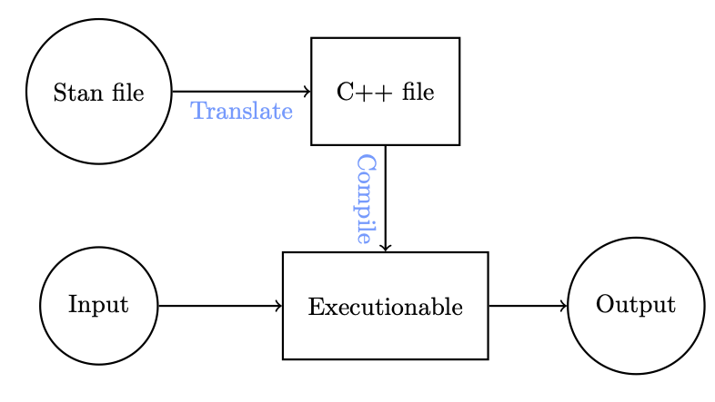
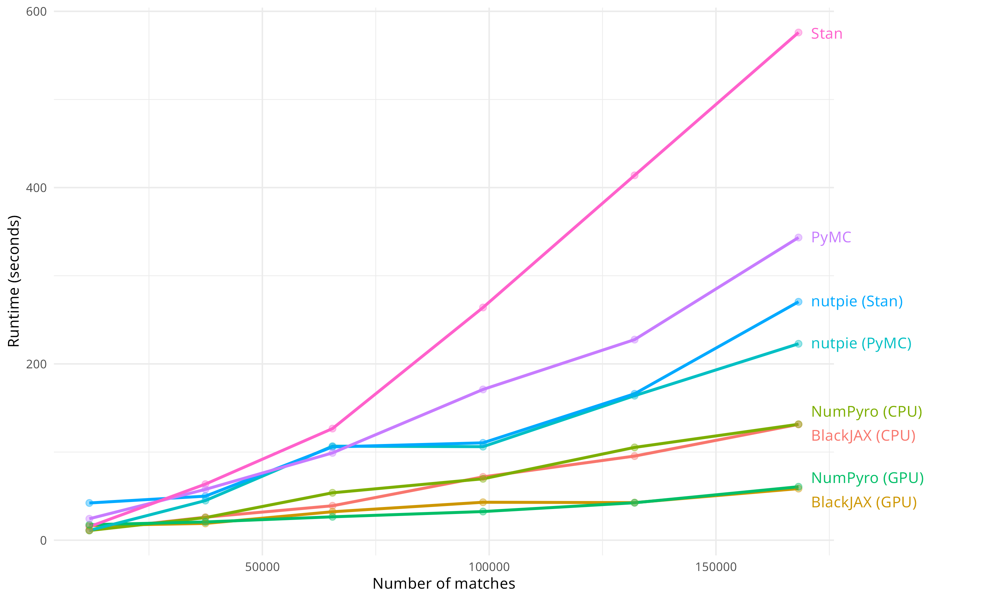
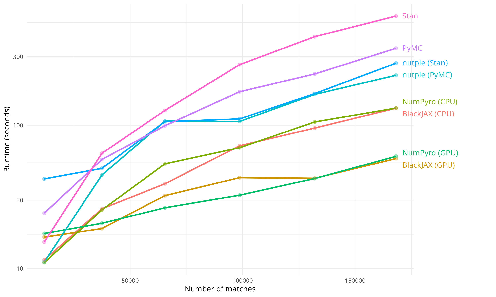
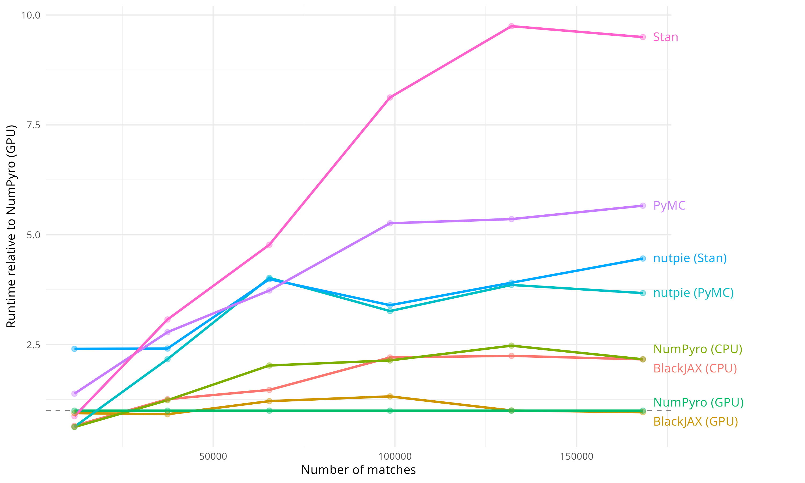

```{r setup, message=FALSE, warning=FALSE, include=FALSE}

```

```{python}
#| include: false

import numpy as np
import matplotlib as mpl
import matplotlib.pyplot as plt
import pandas as pd
import seaborn as sns
import scipy

from pprint import pprint

import timeit
import time

import patsy

import pymc as pm
import arviz as az

import os
os.environ["COLUMNS"] = "110"

plt.rcParams['figure.dpi'] = 200
plt.rcParams["figure.constrained_layout.use"] = True


np.set_printoptions(
  edgeitems=30, linewidth=200,
  precision = 5, suppress=True
  #formatter=dict(float=lambda x: "%.5g" % x)
)

pd.set_option("display.width", 150)
pd.set_option("display.max_columns", 10)
pd.set_option("display.precision", 6)
```


# Example - Gaussian Process

## Data

```{python}
#| include: false

rng = np.random.default_rng(seed=20260221)

n = 250
x = np.sort(rng.uniform(0, 2, n))
y = np.sin(3*np.pi*x) / (3*x+1) + rng.normal(0, 0.1, n)

plt.figure()
plt.plot(x,y,".")
plt.show()

d = pd.DataFrame({"x":x, "y": y})
```

::: {.columns .small}
::: {.column}
```{python}
d
```
:::
::: {.column .fragment}
```{python}
#| echo: false

fig = plt.figure(figsize=(6, 4))
ax = sns.scatterplot(x="x", y="y", data=d)
plt.show()
```
:::
:::


## GP model

::: {.small}
```{python}
X = d.x.to_numpy().reshape(-1,1)
y = d.y.to_numpy()

with pm.Model() as model:
  l = pm.Gamma("l", alpha=2, beta=1)
  s = pm.HalfCauchy("s", beta=5)
  nug = pm.HalfCauchy("nug", beta=5)

  cov = s**2 * pm.gp.cov.ExpQuad(input_dim=1, ls=l)
  gp = pm.gp.Marginal(cov_func=cov)

  like = gp.marginal_likelihood(
    "y", X=X, y=y, sigma=nug
  )
```
:::

## MAP estimates

::: {.xsmall}
```{python}
with model:
  gp_map = pm.find_MAP()
```
:::

. . .

::: {.xsmall}
```{python}
pprint(gp_map)
```
:::


## Full Posterior Sampling

::: {.xsmall}
```{python}
with model:
  post_nuts = pm.sample()
```
:::

. . .

::: {.xsmall}
```{python}
az.summary(post_nuts)
```
:::

. . .

::: {.xsmall}
```{python}
# gp_map w/o logged parameters
{k: v for k, v in gp_map.items() if "log" not in k}
```
:::


## Trace plots

::: {.xsmall}
```{python}
ax = az.plot_trace(post_nuts)
plt.gcf().set_layout_engine("constrained")
plt.show()
```
:::


## Conditional Predictions (MAP)

::: {.xsmall}
```{python}
#| code-line-numbers: "|1|5-7|6"
X_new = np.linspace(0, 2.2, 221).reshape(-1, 1)

with model:
  y_pred = gp.conditional("y_pred", X_new)
  pred_map = pm.sample_posterior_predictive(
    [gp_map], var_names=["y_pred"]
  )
```

:::

. . .

```{python}
#| echo: false
d_pred = pd.DataFrame({
  "y": pred_map.posterior_predictive["y_pred"].values.reshape(-1),
  "x": X_new.reshape(-1)
})

fig = plt.figure(figsize=(12, 5))
ax = sns.scatterplot(x="x", y="y", data=d)
ax = sns.lineplot(x="x", y="y", data=d_pred, color='red')
plt.show()
```


## Conditional Predictions (full posterior)


::: {.small}
```{python}
#| code-line-numbers: "|3"
with model:
  pred_post = pm.sample_posterior_predictive(
    post_nuts.sel(draw=slice(None,None,10)), var_names=["y_pred"]
  )
```
:::

. . .

```{python}
#| echo: false
fig = plt.figure(figsize=(12, 5))
ax = sns.scatterplot(x="x", y="y", data=d)
for y in pred_post.posterior_predictive["y_pred"][0]:
  ax = plt.plot(X_new.reshape(-1), y, color='grey', alpha=0.1)
ax = plt.plot(
  X_new.reshape(-1), 
  pred_post.posterior_predictive["y_pred"].mean(dim=["chain", "draw"]),
  color='red', label="post mean"
)
l = plt.legend()
plt.show()
```


## Conditional Predictions (posterior + nugget)


::: {.small}
```{python}
#| code-line-numbers: "|2,4"
with model:
  y_star = gp.conditional("y_star", X_new, pred_noise=True)
  predn_post = pm.sample_posterior_predictive(
    post_nuts.sel(draw=slice(None,None,10)), var_names=["y_star"]
  )
```
:::

. . .

```{python}
#| echo: false

fig = plt.figure(figsize=(12, 5))
ax = sns.scatterplot(x="x", y="y", data=d)
for y in predn_post.posterior_predictive["y_star"][0]:
  ax = plt.plot(X_new.reshape(-1), y, color='grey', alpha=0.1)
ax = plt.plot(
  X_new.reshape(-1), 
  predn_post.posterior_predictive["y_star"].mean(dim=["chain", "draw"]),
  color='red', label="post mean"
)
l = plt.legend()
plt.show()
```


# Sampler Backends

## Alternative NUTS sampler backends 

Beyond the ability of PyMC to use different sampling steps - it can also use different sampler algorithm implementations to run your model.

These can be changed via the `nuts_sampler` argument which currently supports:

* `pymc` - standard NUTS sampler using pymc's C backend

* `blackjax` - uses the blackjax library which is a collection of samplers written for JAX

* `numpyro` - probabilistic programming library for pyro built using JAX

* `nutpie` - provides a wrapper to the `nuts-rs` Rust library (slight variation on NUTS implementation)

## Notes on installation

Before using the above sampler backends, you will need to install the relevant packages.  

For example, to use the `blackjax` sampler, you will need to install the `blackjax` package and its dependencies (e.g. `jax`).  Similarly, for `numpyro`, you will need to install the `numpyro` package and its dependencies.

Many of these packages have extras that also need to be designated if you want full functionality (e.g. GPU support). Some common examples:

  * `uv add "jax[cuda]"` to add CUDA support to JAX

  * `uv add "nutpie[all]`" to add both pymc and stan support for nutpie

## Sampler backend comparison

The four backends differ in their underlying implementation and parallelism model:

| Backend | Language | Parallelism |
|---------|----------|-------------|
| `pymc`    | C (Aesara/PyTensor) | 1 core per chain |
| `blackjax`| JAX (XLA-compiled) | Multiple cores / GPU across chains |
| `numpyro` | JAX (XLA-compiled) | Multiple cores / GPU across chains |
| `nutpie`  | Rust (`nuts-rs`)   | 1 core per chain |

- JAX-based samplers (`blackjax`, `numpyro`) JIT-compile the model and can exploit multi-core CPUs or GPUs, but have higher compilation overhead on first run
- `pymc` and `nutpie` run each chain on a single core; chains are run in parallel via Python multiprocessing
- On small models the JAX compilation cost can dominate; on large models or with GPU hardware the JAX backends tend to win

## The nutpie sampler

`nutpie` wraps the [`nuts-rs`](https://github.com/pymc-devs/nuts-rs) Rust implementation of NUTS:

- Written in Rust for low-overhead, cache-friendly execution — no Python/C interpreter overhead per leapfrog step
- Uses a **mass-matrix adaptation** scheme that estimates the full dense mass matrix (vs. PyMC's diagonal default), which can improve sampling efficiency on correlated posteriors
- Supports both PyMC models and Stan models
- Support pre-compiling the model which separates the compilation cost from sampling

## Performance

```{python}
#| include: false

X = d.x.to_numpy().reshape(-1,1)
y = d.y.to_numpy()

with pm.Model() as model:
  l = pm.Gamma("l", alpha=2, beta=1)
  s = pm.HalfCauchy("s", beta=5)
  nug = pm.HalfCauchy("nug", beta=5)

  cov = s**2 * pm.gp.cov.ExpQuad(input_dim=1, ls=l)
  gp = pm.gp.Marginal(cov_func=cov)

  y_ = gp.marginal_likelihood(
    "y", X=X, y=y, sigma=nug
  )
```

::: {.columns .xxsmall}
::: {.column}
```{python model_pymc}
start = time.time()
with model:
    post_nuts = pm.sample(
      nuts_sampler="pymc", chains=4, progressbar=False
    )
print(f"pymc: {time.time() - start:.1f}s")
```
:::
::: {.column}
```{python model_blackjax}
start = time.time()
with model:
    post_blackjax = pm.sample(
      nuts_sampler="blackjax", chains=4, progressbar=False
    )
print(f"blackjax: {time.time() - start:.1f}s")
```
:::
:::

::: {.columns .xsmall}
::: {.column}
```{python model_pyro}
start = time.time()
with model:
    post_pyro = pm.sample(
      nuts_sampler="numpyro", chains=4, progressbar=False
    )
print(f"numpyro: {time.time() - start:.1f}s")
```
:::
::: {.column}
```{python model_nutpie}
start = time.time()
with model:
    post_nutpie = pm.sample(
      nuts_sampler="nutpie", chains=4, progressbar=False
    )
print(f"nutpie: {time.time() - start:.1f}s")
```
:::
:::

. . .

::: {.xxsmall}
```{python}
import nutpie
compiled = nutpie.compile_pymc_model(model)
```

```{python}
start = time.time()
post_nutpie2 = nutpie.sample(compiled, chains=4, progress_bar=False)
print(f"nutpie (compiled): {time.time() - start:.1f}s")
```
:::


::: {.aside}
Different samplers have different progress bars, some of which do not get along with Quarto
::: 

## Results

::: {.xxsmall}

```{python}
az.summary(post_nuts)
az.summary(post_blackjax)
az.summary(post_pyro)
az.summary(post_nutpie.posterior[["l","s","nug"]])
az.summary(post_nutpie2.posterior[["l","s","nug"]])
```
:::


# Stan

## Stan in Python & R

At the moment both Python & R offer two variants of Stan:

* `pystan` & `RStan` - native language interface to the underlying Stan C++ libraries

  * Former does not play nicely with Jupyter (or quarto or positron) - see [here](https://pystan.readthedocs.io/en/latest/faq.html#how-can-i-use-pystan-with-jupyter-notebook-or-jupyterlab) for a fix

* `CmdStanPy` & `CmdStanR` - are wrappers around the `CmdStan` command line interface
  
  * Interface is through files (e.g. `./model.stan`)

Any of the above tools will require a modern C++ toolchain (C++17 support required).


## Stan process

{fig-align="center" width=75%}

::: {.aside}
From Charles Margossian's [Fundamentals of Stan](https://github.com/charlesm93/stanTutorial/tree/main/StanCon2023)
:::

## Stan file basics

Stan code is divided up into specific blocks depending on usage - all of the following blocks are optional but the ordering has to match what is given below.  

::: {.xsmall}
```stan
functions {
  // user-defined functions
}
data {
  // declares the required data for the model
}
transformed data {
   // allows the definition of constants and transformations of the data
}
parameters {
   // declares the model’s parameters
}
transformed parameters {
   // variables defined in terms of data and parameters
}
model {
   // defines the log probability function
}
generated quantities {
   // derived quantities based on parameters, data, and random number generation
}
```
:::

## GP model in Stan

::: {.xsmall}
::: {.code-file .sourceCode .cell-code}
&nbsp; &nbsp; `r fontawesome::fa("file")` &nbsp; `Lec20/gp.stan`
:::
```stan

```
:::


## Fit

::: {.xsmall}
```{python}
from cmdstanpy import CmdStanModel
d_stan = d.to_dict('list')
d_stan["N"] = len(d["x"])
```
```{python}
#| warning: true
gp = CmdStanModel(stan_file='Lec20/gp.stan')
gp_fit = gp.sample(data=d_stan, show_progress=False)
```
:::

. . .

::: {.small}
```{python}
gp_fit.summary()
```
:::

## Trace plots

::: {.xsmall}
```{python}
ax = az.plot_trace(gp_fit, compact=False)
plt.show()
```
:::

## Diagnostics

::: {.xsmall}
```{python}
gp_fit.divergences
```
```{python}
gp_fit.max_treedepths
```

```{python}
gp_fit.method_variables().keys()
```
:::

. . .

::: {.xsmall}
```{python}
print(gp_fit.diagnose())
```
:::


## nutpie & stan

The `nutpie` package can also be used to compile and run stan models, it uses a package called `bridgestan` to interface with Stan.

::: {.small}
```{python}
import nutpie
m = nutpie.compile_stan_model(filename="Lec20/gp.stan")
m = m.with_data(x=d["x"],y=d["y"],N=len(d["x"]))
gp_fit_nutpie = nutpie.sample(m, chains=4)
```
:::

## 

::: {.xsmall}
```{python}
az.summary(gp_fit_nutpie)
```
:::

::: {.columns}
::: {.column width=12.5%}
:::
::: {.column width=75%}
```{python}
#| echo: false
ax = az.plot_trace(gp_fit_nutpie, compact=False)
plt.show()
```
:::
:::


## Performance

::: {.small}
``` {python}
t_stan_gp = timeit.repeat(
    lambda: gp.sample(data=d_stan, show_progress=False),
    repeat=3, number=1
)
```
``` {python}
#| echo: false
print(f"{sum(t_stan_gp)/len(t_stan_gp):.2f}s ± {(max(t_stan_gp)-min(t_stan_gp))/2:.2f}s (3 runs, 1 loop each)")
```
:::

::: {.small}
``` {python}
t_stan_nutpie_gp = timeit.repeat(
    lambda: nutpie.sample(m, chains=4, progress_bar=False),
    repeat=3, number=1
)
```
``` {python}
#| echo: false
print(f"{sum(t_stan_nutpie_gp)/len(t_stan_nutpie_gp):.2f}s ± {(max(t_stan_nutpie_gp)-min(t_stan_nutpie_gp))/2:.2f}s (3 runs, 1 loop each)")
```
:::

::: {.aside}
Note in both cases above we are not including the compilation time, which can be significant for small models.
:::

## Posterior predictive model

::: {.xxsmall}
::: {.code-file .sourceCode .cell-code}
&nbsp; &nbsp; `r fontawesome::fa("file")` &nbsp; `Lec20/gp2.stan`
:::
```stan

```
:::

## Posterior predictive fit

::: {.xsmall}
```{python}
d_stan = d.to_dict('list')
d_stan["N"] = len(d_stan["x"])
d_stan["xp"] = np.linspace(0, 2.2, 221)
d_stan["Np"] = len(d_stan["xp"])
```
```{python}
#| warning: true
gp2 = CmdStanModel(stan_file='Lec20/gp2.stan')
gp2_fit = gp2.sample(data=d_stan, show_progress=False)
```
:::

. . .

::: {.small}
```{python}
gp2_fit.summary()
```
:::

## Draws

::: {.xsmall}
```{python}
gp2_fit.stan_variable("f").shape
```

```{python}
np.mean(gp2_fit.stan_variable("f"), axis=0)
```
:::

## Plot

```{python}
#| echo: false
fig = plt.figure(figsize=(12, 5))
ax = sns.scatterplot(x="x", y="y", data=d_stan)
for y in gp2_fit.stan_variable("f")[::40]:
  ax = plt.plot(d_stan["xp"], y, color='grey', alpha=0.1)
ax = plt.plot(
  d_stan["xp"], 
  np.mean(gp2_fit.stan_variable("f"), axis=0),
  color='red', label="post mean"
)
l = plt.legend()
plt.show()
```

# Tennis Model Performance

## The Data

- Jeff Sackmann's [ATP tennis dataset](https://github.com/JeffSackmann/tennis_atp) — match records from 1968 to present
- Each match record contains winning and losing player names; these are encoded as integer IDs
- Goal is to estimate latent player skill levels from match outcomes using a hierarchical Bradley-Terry model
  - $\text{logit} \, P(\text{player } i \text{ beats player } j) = \text{skill}_i - \text{skill}_j$
- Benchmark datasets created by filtering from different `start_year` values (1970, 1980, 1990, 2000, 2010, 2020), giving datasets of increasing size

::: {.aside}
Model and data from Martin Ingram's ["MCMC for big datasets -- faster sampling with JAX and the GPU"](https://martiningram.github.io/mcmc-comparison/); results based on [martiningram/mcmc_runtime_comparison](https://github.com/martiningram/mcmc_runtime_comparison) and are available in [rundel/mcmc_runtime_comparison](https://github.com/rundel/mcmc_runtime_comparisons).
:::

## Testing Setup

All benchmarks run on a departmental server with no CPU or GPU constraints:

::: {.incremental}
- *CPU* - AMD Ryzen 9 7950X (16-core / 32-thread)
- *GPU* - 2× NVIDIA RTX A4000 (16 GB VRAM each)
- Each sampler run with *2 chains*, *1000 draws*, *1000 tuning steps*
- JAX-based samplers (`numpyro`, `blackjax`) benchmarked in both `cpu_parallel` and `gpu_parallel` modes
- `nutpie` benchmarked with both PyMC and Stan compiled models 
- Timing measured as wall-clock seconds per sampling run (including compile time)
- All GPU results are using 64-bit precision 
:::

## The Models

::: {.columns}
::: {.column}
**PyMC**

::: {.xsmall}
```python
with pm.Model() as model:
    player_sd = pm.HalfNormal("player_sd", sigma=1.0)

    player_skills_raw = pm.Normal(
        "player_skills_raw", 0., sigma=1.,
        shape=(n_players,)
    )
    player_skills = pm.Deterministic(
        "player_skills", player_skills_raw * player_sd
    )
    logit_p = player_skills[winner_ids] - player_skills[loser_ids]

    win_lik = pm.Bernoulli(
        "win_lik", logit_p=logit_p,
        observed=np.ones(n_matches)
    )
```
:::

:::
::: {.column}
**Stan**

::: {.xsmall}
```stan
parameters {
    vector[n_players] player_skills_raw;
    real<lower=0> player_sd;
}
transformed parameters {
    vector[n_players] player_skills =
        player_skills_raw * player_sd;
}
model {
    player_skills_raw ~ std_normal();
    player_sd ~ normal(0, 1);
    vector[n_matches] mu;
    for (n in 1:n_matches)
        mu[n] = player_skills[winner_ids[n]]
              - player_skills[loser_ids[n]];
    1 ~ bernoulli_logit(mu);
}
```
:::

:::
:::

## Results

{fig-align="center" width=90%}

## Results (log scale)

{fig-align="center" width=90%}

## Results (relative to NumPyro GPU)

{fig-align="center" width=90%}

