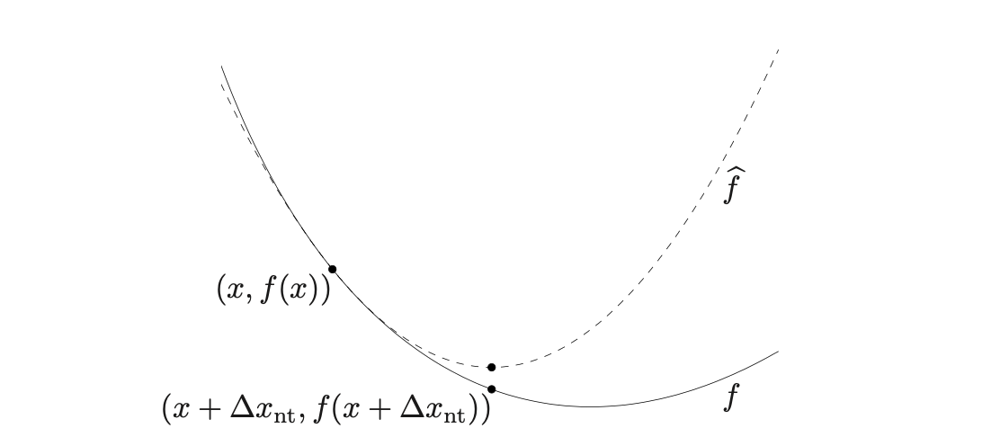

```{python}
#| include: false
import numpy as np
import matplotlib as mpl
import matplotlib.pyplot as plt
import pandas as pd
import seaborn as sns
import warnings

import jax
import jax.numpy as jnp

import sklearn
sklearn.set_config(display="text")
from sklearn.model_selection import GridSearchCV
from sklearn.linear_model import LinearRegression, Ridge, Lasso

plt.rcParams['figure.dpi'] = 200

np.set_printoptions(
  edgeitems=30, linewidth=75,
  precision = 4, suppress=True
  #formatter=dict(float=lambda x: "%.5g" % x)
)

pd.set_option("display.width", 100)
pd.set_option("display.max_columns", 10)
pd.set_option("display.precision", 4)

from scipy import optimize
```

```{r setup, message=FALSE, warning=FALSE, include=FALSE}

```

## Optimization

Optimization problems underlie nearly everything we do in Machine
Learning and Statistics. 

Most models can be formulated as 

$$
P \; : \; \underset{x \in \boldsymbol{D}}{\text{arg min}} \; f(x) 
$$

. . .

* Formulating a problem $P$ is not the same as being able to solve $P$ in practice

* Many different algorithms exist for optimization but their performance varies widely depending on the exact nature of the problem


# Gradient Descent

## Naive Gradient Descent

The basic idea behind this approach is that the gradient of a function tells us the direction of steepest ascent (or descent). Therefore, to find the minimum we should take our next step in the direction of the negative gradient to most quickly approach the nearest minima.

<br/>

Given an $n$-dimensional function $f(x_1, \ldots, x_n)$, and an initial position $x_k$ then our update rule is,

$$
x_{k+1} = x_{k} - \alpha \nabla f(x_k)
$$

here $\alpha$ refers to the step length or the learning rate which determines how big a step we will take.


## Implementation

::: {.xsmall}
```{python}
#| code-line-numbers: "|1|2|6|7,8|5,16,17"
def grad_desc_1d(x, f, grad, step, max_step=100, tol = 1e-6):
  res = {"x": [x], "f": [f(x)]}

  try:
    for i in range(max_step): 
      x = x - grad(x) * step
      if np.abs(x - res["x"][-1]) < tol: 
        break

      res["f"].append( f(x) )
      res["x"].append( x )
      
  except OverflowError as err:
    print(f"{type(err).__name__}: {err}")
  
  if i == max_step-1:
    warnings.warn("Failed to converge!", RuntimeWarning)
  
  return res
```
:::

```{python include=FALSE}
def plot_1d_traj(x, f, traj, title="", figsize=(5,3)):
  plt.figure(figsize=figsize, layout="constrained")
  
  x_range = x[1]-x[0]

  x_focus = np.linspace(x[0], x[1], 101)
  x_ext = np.linspace(x[0]-0.2*x_range, x[1]+0.2*x_range, 141)

  plt.plot(x_focus, f(x_focus), "-k")
  
  xlim = plt.xlim()
  ylim = plt.ylim()
  
  plt.plot(x_ext, f(x_ext), "-k")

  plt.plot(traj["x"], traj["f"], ".-b", ms = 10)
  plt.plot(traj["x"][0], traj["f"][0], ".r", ms = 15)
  plt.plot(traj["x"][-1], traj["f"][-1], ".c", ms = 15)

  plt.xlim(xlim)
  plt.ylim(ylim)
  
  plt.show()
  
  plt.close('all')
```

## A basic example

:::: {.columns .xsmall}
::: {.column width='50%'}
$$
\begin{aligned}
f(x) &= x^2 \\
\nabla f(x) &= 2x
\end{aligned}
$$
:::

::: {.column width='50%'}
```{python}
f = lambda x: x**2
grad = lambda x: 2*x
```
:::
::::

. . .

:::: {.columns .xsmall}
::: {.column width='50%'}
```{python}
#| out-width: 90%
opt = grad_desc_1d(-2., f, grad, step=0.25)
plot_1d_traj( (-2, 2), f, opt )
```
:::

::: {.column width='50%' .fragment}
```{python}
#| out-width: 90%
opt = grad_desc_1d(-2., f, grad, step=0.5)
plot_1d_traj( (-2, 2), f, opt )
```
:::
::::


## Where can it go wrong?

If you pick a bad step size ...

. . .

:::: {.columns .xsmall}
::: {.column width='50%'}
```{python}
#| out-width: 90%
opt = grad_desc_1d(-2, f, grad, step=0.9)
plot_1d_traj( (-2,2), f, opt )
```
:::

::: {.column width='50%' .fragment}
```{python}
#| out-width: 90%
opt = grad_desc_1d(-2, f, grad, step=1)
plot_1d_traj( (-2,2), f, opt )
```
:::
::::


## Local minima

The function below has multiple minima, both starting point and step size affect the solution we obtain,

:::: {.columns .xsmall}
::: {.column width='50%'}
$$
\begin{aligned}
f(x) &= x^4 + x^3 -x^2 - x \\
\nabla f(x) &= 4x^3 + 3x^2 - 2x - 1
\end{aligned}
$$
:::

::: {.column width='50%'}
```{python}
f = lambda x: x**4 + x**3 - x**2 - x 
grad = lambda x: 4*x**3 + 3*x**2 - 2*x - 1
```
:::
::::

. . .

:::: {.columns .xsmall}
::: {.column width='50%'}

```{python out.width="90%", error=TRUE}
opt = grad_desc_1d(-1.5, f, grad, step=0.2)
plot_1d_traj( (-1.5, 1.5), f, opt )
```
:::

::: {.column width='50%' .fragment}
```{python out.width="90%", error=TRUE}
opt = grad_desc_1d(-1.5, f, grad, step=0.25)
plot_1d_traj( (-1.5, 1.5), f, opt)
```
:::
::::


## Alternative starting points

:::: {.columns .xsmall}
::: {.column width='50%'}
```{python out.width="90%", error=TRUE}
opt = grad_desc_1d(1.5, f, grad, step=0.2)
plot_1d_traj( (-1.75, 1.5), f, opt )
```
:::

::: {.column width='50%' .fragment}
```{python out.width="90%", error=TRUE}
opt = grad_desc_1d(1.25, f, grad, step=0.2)
plot_1d_traj( (-1.75, 1.5), f, opt)
```
:::
::::


## Problematic step sizes

If the step size is too large it is possible for the algorithm to overflow,

:::: {.columns .xsmall}
::: {.column width='50%'}

```{python out.width="90%", error=TRUE}
opt = grad_desc_1d(-1.5, f, grad, step=0.75)
plot_1d_traj( (-3, 3), f, opt)
```
:::

::: {.column width='50%'}
```{python out.width="90%", error=TRUE}
opt['x']
opt['f']
```
:::
::::

##  Gradient Descent w/ backtracking

As we have just seen having too large of a step can 
be problematic, one solution is to allow the step size
to adapt.

Backtracking involves checking if the proposed move is
advantageous (i.e. $f(x_k-\alpha \nabla f(x_k)) < f(x_k)$),

* If it is downhill then accept
  $x_{k+1} = x_k-\alpha \nabla f(x_k)$.

* If not, adjust $\alpha$ by a factor $\tau$ (e.g. 0.5)
  and check again.
  
Pick larger $\alpha$ to start (but not so large so as to overflow) and then let the backtracking tune things.

::: {.aside}
This is a simplified (hand-wavy) version of the [Armijo-Goldstein condition](https://en.wikipedia.org/wiki/Backtracking_line_search) <br/>
Check $f(x_k-\alpha \nabla f(x_k)) \leq f(x_k) - c \alpha (\nabla f(x_k))^2$.
:::

## Implementation

::: {.xsmall}
```{python}
#| code-line-numbers: "|6-11"
def grad_desc_1d_bt(x, f, grad, step, tau=0.5, max_step=100, max_back=10, tol = 1e-6):
  res = {"x": [x], "f": [f(x)]}
  
  for i in range(max_step):
    grad_f = grad(x)
    for j in range(max_back):
      x = res["x"][-1] - step * grad_f
      f_x = f(x)
      if (f_x < res["f"][-1]): 
        break
      step = step * tau
    
    if np.abs(x - res["x"][-1]) < tol: 
      break
    res["x"].append(x)
    res["f"].append(f_x)
    
  if i == max_step-1:
    warnings.warn("Failed to converge!", RuntimeWarning)
  
  return res
```
:::


##

:::: {.columns .xsmall}
::: {.column width='50%'}
```{python}
#| error: true
#| out-width: 90%
opt = grad_desc_1d_bt(
  -1.5, f, grad, step=0.75, tau=0.5
)
plot_1d_traj( (-1.5, 1.5), f, opt )
```
:::

::: {.column width='50%' .fragment}
```{python}
#| error: true
#| out-width: 90%
opt = grad_desc_1d_bt(
  1.5, f, grad, step=0.25, tau=0.5
)
plot_1d_traj( (-1.5, 1.5), f, opt)
```
:::
::::


## A 2d cost function

```{python include=FALSE}
# Code from https://scipy-lectures.org/ on optimization

def mk_quad(epsilon, ndim=2):
  def f(x):
    x = np.asarray(x)
    y = x.copy()
    y *= np.power(epsilon, np.arange(ndim))
    return .33*np.sum(y**2)
  
  def gradient(x):
    x = np.asarray(x)
    y = x.copy()
    scaling = np.power(epsilon, np.arange(ndim))
    y *= scaling
    return .33*2*scaling*y
  
  def hessian(x):
    scaling = np.power(epsilon, np.arange(ndim))
    return .33*2*np.diag(scaling)
  
  return f, gradient, hessian

def mk_rosenbrock():
  def f(x):
    x = np.asarray(x)
    y = 4*x
    y[0] += 1
    y[1:] += 3
    return np.sum(.5*(1 - y[:-1])**2 + (y[1:] - y[:-1]**2)**2)
  
  def gradient(x):
    x = np.asarray(x)
    y = 4*x
    y[0] += 1
    y[1:] += 3
    xm = y[1:-1]
    xm_m1 = y[:-2]
    xm_p1 = y[2:]
    der = np.zeros_like(y)
    der[1:-1] = 2*(xm - xm_m1**2) - 4*(xm_p1 - xm**2)*xm - .5*2*(1 - xm)
    der[0] = -4*y[0]*(y[1] - y[0]**2) - .5*2*(1 - y[0])
    der[-1] = 2*(y[-1] - y[-2]**2)
    return 4*der
  
  def hessian(x):
    x = np.asarray(x)
    y = 4*x
    y[0] += 1
    y[1:] += 3
    
    H = np.diag(-4*y[:-1], 1) - np.diag(4*y[:-1], -1)
    diagonal = np.zeros_like(y)
    diagonal[0] = 12*y[0]**2 - 4*y[1] + 2*.5
    diagonal[-1] = 2
    diagonal[1:-1] = 3 + 12*y[1:-1]**2 - 4*y[2:]*.5
    H = H + np.diag(diagonal)
    return 4*4*H
  
  return f, gradient, hessian
```


We will be using `mk_quad()` to create quadratic functions with varying conditioning (as specified by the `epsilon` parameter).

$$
\begin{align}
f(x,y) &= 0.33(x^2 + \epsilon^2 y^2 ) \\
\nabla f(x,y) &= \left[ \begin{matrix}
0.66 \, x \\
0.66 \, \epsilon^2 \, y 
\end{matrix} \right] \\
\nabla^2 f(x,y) &= \left[\begin{array}{cc}
0.66  & 0 \\
0     & 0.66 \, \epsilon^2
\end{array}\right]
\end{align}
$$


## Examples

```{python include=FALSE}
def super_fmt(value):
    if value > 1:
        if np.abs(int(value) - value) < .1:
            out = '$10^{%.1i}$' % value
        else:
            out = '$10^{%.1f}$' % value
    else:
        value = np.exp(value - .01)
        if value > .1:
            out = '%1.1f' % value
        elif value > .01:
            out = '%.2f' % value
        else:
            out = '%.2e' % value
    return out

def plot_2d_traj(x, y, f, traj=None, title="", figsize=(5,5)):
  x_min, x_max = x
  y_min, y_max = y
  
  plt.figure(figsize=figsize, layout="constrained")
  
  x, y = np.mgrid[x_min:x_max:100j, y_min:y_max:100j]
  x = x.T
  y = y.T
  
  plt.figure(figsize=figsize)
  #plt.clf()
  #plt.axes([0, 0, 1, 1])
  
  X = np.concatenate((x[np.newaxis, ...], y[np.newaxis, ...]), axis=0)
  z = np.apply_along_axis(f, 0, X)
  log_z = np.log(z + .01)
  plt.imshow(
    log_z,
    extent=[x_min, x_max, y_min, y_max],
    cmap=plt.cm.gray_r, origin='lower',
    vmax=log_z.min() + 1.5*np.ptp(log_z)
  )
  contours = plt.contour(
    log_z,
    extent=[x_min, x_max, y_min, y_max],
    cmap=plt.cm.gnuplot, origin='lower'
  )
  
  plt.clabel(contours, inline=1, fmt=super_fmt, fontsize=12)
  
  if not traj is None:
    tx, ty = zip(*traj["x"])

    plt.plot(tx, ty, ".-b", ms = 10)
    plt.plot(tx[0], ty[0], ".r", ms = 15)
    plt.plot(tx[-1], ty[-1], ".c", ms = 15)
  
  if not title == "":
    plt.title(title)
  
  plt.xlim(x_min, x_max)
  plt.ylim(y_min, y_max)
  
  plt.show()
  plt.close('all')
  
```

:::: {.columns .xsmall}
::: {.column width='50%'}
```{python}
#| out-width: 100%
f, grad, hess = mk_quad(0.7)
plot_2d_traj(
  (-1,2), (-1,2), f, title="ε=0.7"
)
```
:::

::: {.column width='50%'}
```{python}
#| out-width: 100%
f, grad, hess = mk_quad(0.05)
plot_2d_traj(
  (-1,2), (-1,2), f, title="ε=0.05"
)
```
:::
::::

## $n$-d gradient descent w/ backtracking

::: {.xsmall}
```{python}
#| code-line-numbers: "|14,15"
def grad_desc(x, f, grad, step, tau=0.5, max_step=100, max_back=10, tol = 1e-8):
  res = {"x": [x], "f": [f(x)]}
  
  for i in range(max_step):
    grad_f = grad(x)
    
    for j in range(max_back):
      x = res["x"][-1] - grad_f * step
      f_x = f(x)
      if (f_x < res["f"][-1]): 
        break
      step = step * tau

    if np.sqrt(np.sum((x - res["x"][-1])**2)) < tol: 
      break  
    
    res["x"].append(x)
    res["f"].append(f_x)
      
  if i == max_step-1:
    warnings.warn("Failed to converge!", RuntimeWarning)
    
  return res
```
:::


## Well conditioned cost function

:::: {.columns .xxsmall}
::: {.column width='50%'}
```{python}
#| out-width: 95%
f, grad, hess = mk_quad(0.7)
opt = grad_desc((1.6, 1.1), f, grad, step=1)
plot_2d_traj(
  (-1,2), (-1,2), f, title="ε=0.7", traj=opt
)
```
:::

::: {.column width='50%'}
```{python}
#| out-width: 95%
f, grad, hess = mk_quad(0.7)
opt = grad_desc((1.6, 1.1), f, grad, step=2)
plot_2d_traj(
  (-1,2), (-1,2), f, title="ε=0.7", traj=opt
)
```
:::
::::


## Ill-conditioned cost function

:::: {.columns .xxsmall}
::: {.column width='50%'}
```{python}
#| out-width: 95%
f, grad, hess = mk_quad(0.05)
opt = grad_desc((1.6, 1.1), f, grad, step=1)
plot_2d_traj(
  (-1,2), (-1,2), f, title="ε=0.05", traj=opt
)
```
:::

::: {.column width='50%'}
```{python}
#| out-width: 95%
f, grad, hess = mk_quad(0.05)
opt = grad_desc((1.6, 1.1), f, grad, step=2)
plot_2d_traj(
  (-1,2), (-1,2), f, title="ε=0.05", traj=opt
)
```
:::
::::

## Aside - Ill-conditioned functions

A function is **ill-conditioned** when the Hessian has eigenvalues that differ by orders of magnitude. The **condition number** $\kappa = \lambda_\text{max} / \lambda_\text{min}$ measures this:

* $\kappa \approx 1$ - well-conditioned, contours are nearly circular, GD converges quickly

* $\kappa \gg 1$ - ill-conditioned, contours are highly elongated, GD zigzags slowly

For `mk_quad(epsilon)`, the Hessian eigenvalues are $0.66$ and $0.66\epsilon^2$, giving $\kappa = 1/\epsilon^2$. With $\epsilon = 0.05$ we have $\kappa = 400$.

## Rosenbrock's function

Another classic ill-conditioned function commonly used to benchmark optimization algorithms,

$$
f(u, v) = \tfrac{1}{2}(1 - u)^2 + (v - u^2)^2
$$

Our scaled version uses $u = 4x+1$ and $v = 4y+3$,

$$
f(x, y) = 8x^2 + \big(4y + 3 - (4x+1)^2\big)^2
$$

* Minimum at $(u^*, v^*) = (1, 1)$, i.e. $(x^*, y^*) = (0, -\tfrac{1}{2})$ where $f = 0$

* Has a narrow, curved (banana-shaped) valley - easy to find the valley, hard to follow it to the minimum

* Condition number of the Hessian at the minimum is $\approx 2500$


## Rosenbrock function (very ill conditioned)

:::: {.columns .xsmall}
::: {.column width='50%'}
```{python}
#| out-width: 95%
f, grad, hess = mk_rosenbrock()
opt = grad_desc((1.6, 1.1), f, grad, step=0.25)
plot_2d_traj((-2,2), (-2,2), f, traj=opt)
```
:::

::: {.column width='50%' .fragment}
```{python}
#| out-width: 95%
f, grad, hess = mk_rosenbrock()
opt = grad_desc((-0.5, 0), f, grad, step=0.25)
plot_2d_traj((-2,2), (-2,2), f, traj=opt)
```
:::
::::

## Some regression examples {.scrollable}

::: {.xsmall}
```{python}
from sklearn.datasets import make_regression
X, y, coef = make_regression(
  n_samples=200, n_features=20, n_informative=4, 
  bias=3, noise=1, random_state=1234, coef=True
)
```
:::

::: {.columns .xxsmall}
::: {.column width=15%}
```{python}
y
```
:::
::: {.column width=70%}
```{python}
X
```
:::
::: {.column width=15%}
```{python}
coef.reshape((-1,1))
```
:::
:::

## A jax implementation of GD

::: {.xsmall}
```{python}
def grad_desc_jax(x, f, step, tau=0.5, max_step=100, max_back=10, tol = 1e-8):
  grad_f = jax.grad(f)
  f_x = f(x)
  converged = False

  for i in range(max_step):
    grad_f_x = grad_f(x)
    
    for j in range(max_back):
      new_x = x - grad_f_x * step
      new_f_x = f(new_x)
      if (new_f_x < f_x): 
        break
      step *= tau

    cur_tol = jnp.sqrt(jnp.sum((x - new_x)**2))

    x = new_x 
    f_x = new_f_x

    if cur_tol < tol: 
      converged = True
      break
  
  if not converged:
    warnings.warn("Failed to converge!", RuntimeWarning)

  return {
    "x": x,
    "n_iter": i,
    "converged": converged,
    "final_tol": float(cur_tol),
    "final_step": step
  }
```
:::


## Linear regression

::: {.xsmall}
```{python}
lm = LinearRegression().fit(X,y)
np.r_[lm.intercept_, lm.coef_]
```
:::

. . .

::: {.xsmall}
```{python}
def jax_linear_regression(X, y, beta):
  Xb = jnp.c_[jnp.ones(X.shape[0]), X]
  return jnp.sum((y - Xb @ beta)**2)

grad_desc_jax(
  np.zeros(X.shape[1]+1), 
  lambda beta: jax_linear_regression(X,y,beta), 
  step = 1, tau = 0.5
)
```
:::


## Ridge regression

::: {.xsmall}
```{python}
r = GridSearchCV(Ridge(), param_grid = {"alpha": np.logspace(-3,0)}).fit(X,y)
r.best_estimator_
np.r_[r.best_estimator_.intercept_, r.best_estimator_.coef_]
```
:::

. . .

::: {.xsmall}
```{python}
def jax_ridge(X, y, beta, alpha):
  Xb = jnp.c_[jnp.ones(X.shape[0]), X]
  ls_loss = jnp.sum((y - Xb @ beta)**2)
  coef_loss = jnp.sum(beta[1:]**2)
  return ls_loss + alpha * coef_loss

grad_desc_jax(
  np.zeros(X.shape[1]+1), 
  lambda beta: jax_ridge(X, y, beta, r.best_estimator_.alpha), 
  step = 1, tau = 0.5, tol=1e-8
)
```
:::

## Lasso

::: {.xsmall}
```{python}
ls = GridSearchCV(Lasso(), param_grid = {"alpha": np.logspace(-3,0)}).fit(X,y)
ls.best_estimator_
np.r_[ls.best_estimator_.intercept_, ls.best_estimator_.coef_]
```
:::

. . .

::: {.xsmall}
```{python}
def jax_lasso(X, y, beta, alpha):
  n = X.shape[0]
  Xb = jnp.c_[jnp.ones(n), X]
  ls_loss = (1/(2*n))*jnp.sum((y - Xb @ beta)**2)
  coef_loss = jnp.sum(jnp.abs(beta[1:]))
  return ls_loss + alpha * coef_loss

grad_desc_jax(
  np.zeros(X.shape[1]+1), 
  lambda beta: jax_lasso(X, y, beta, ls.best_estimator_.alpha), 
  step = 1, tau = 0.5, tol=1e-10
)
```
:::


## Limitations of gradient descent

* Converges to a *local* minima - sensitive to starting location

  * Global convergence guarantees only hold for convex functions

* Requires gradient computation at every step - expensive when $n$ is large or the gradient has no closed form

* Sensitive to the choice of learning rate - too large diverges, too small converges slowly

* Uses a scalar step size applied uniformly in all directions - performs poorly on ill-conditioned problems where the optimal step varies by direction


# Newton's Method


## Newton's Method in 1d

Let's assume we have a 1d function $f(x)$ we are trying to optimize, our current guess is $x$ and we want to know how to generate our next step $\Delta x$.

We start by constructing the 2nd order Taylor approximation of our function at $x+\Delta x$,

$$
f(x + \Delta x) \approx \widehat{f}(x + \Delta x) = f(x) + \Delta x f'(x) + \frac{1}{2} (\Delta x)^2 f''(x)
$$

. . .


{width=50% fig-align="center"}

::: {.aside}
Figure 9.16 from Boyd & Vandenberghe (2004)
:::

## Finding the Newton step

Our optimal step then becomes the value of $\Delta x$ that minimizes the quadratic given by our Taylor approximation.

. . .

::: {.small}
$$ 
\frac{\partial}{\partial \Delta x} \widehat{f}(x+\Delta x) = 0 
$$
$$
\frac{\partial}{\partial \Delta x} \left(f(x) + \Delta x f'(x) + \frac{1}{2} (\Delta x)^2 f''(x) \right) = 0\\
$$
$$
f'(x) + \Delta x f''(x) = 0\\
$$
$$
\Delta x = -\frac{f'(x)}{f''(x)}
$$
:::

. . .

this suggests an iterative update rule of 

::: {.small}
$$
x_{k+1} = x_{k} -\frac{f'(x_k)}{f''(x_k)}
$$
:::


## Generalizing to $n$d

Based on the same argument we can see the following result for a function in $\mathbb{R}^n$,

$$
f(x + \Delta x) \approx \widehat{f}(x) = f(x) + \Delta x^T \nabla f(x) + \frac{1}{2} \Delta x^T \, \nabla^2 f(x) \,\Delta x
$$

::: {.columns}
::: {.column}
then

::: {.small}
$$
\frac{\partial}{\partial \Delta x} \widehat{f}(x) = 0 \\
\nabla f(x) + \nabla^2 f(x) \,  \Delta x = 0\\
\Delta x = -\left(\nabla^2 f(x)\right)^{-1} \nabla f(x)
$$
:::

:::
::: {.column}
where 

* $\nabla f(x)$ is the $n \times 1$ gradient vector 

* and $\nabla^2 f(x)$ is the $n \times n$ Hessian matrix.
:::
:::

. . .

based on these results our $n$d update rule is

$$
x_{k+1} = x_{k} - (\nabla^2 f(x_k))^{-1} \, \nabla f(x_k)
$$


## Implementation

::: {.small}
```{python}
#| code-line-numbers: "|7"
def newtons_method(x, f, grad, hess, max_iter=100, tol=1e-8):
    x = np.array(x)
    s = x.shape
    res = {"x": [x], "f": [f(x)]}
    
    for i in range(max_iter):
      x = x - np.linalg.solve(hess(x), grad(x))
      x = x.reshape(s)

      if np.sqrt(np.sum((x - res["x"][-1])**2)) < tol:
        break

      res["x"].append(x)
      res["f"].append(f(x))
    
    return res
```
:::


## A basic example

:::: {.columns .xsmall}
::: {.column width='50%'}
$$
\begin{aligned}
f(x) &= x^2 \\
\nabla f(x) &= 2x \\
\nabla^2 f(x) &= 2
\end{aligned}
$$
:::

::: {.column width='50%'}
```{python}
f = lambda x: np.array(x**2)
grad = lambda x: np.array([2*x])
hess = lambda x: np.array([[2]])
```
:::
::::

. . .

:::: {.columns .xsmall}
::: {.column width='50%'}
```{python}
#| out-width: 90%
opt = newtons_method(-2., f, grad, hess)
plot_1d_traj( (-2, 2), f, opt )
```
:::

::: {.column width='50%' .fragment}
```{python}
#| out-width: 90%
opt = newtons_method(1., f, grad, hess)
plot_1d_traj( (-2, 2), f, opt )
```
:::
::::


## 1d Quartic

:::: {.columns .xsmall}
::: {.column width='50%'}
$$
\begin{aligned}
f(x) &= x^4 + x^3 -x^2 - x \\
\nabla f(x) &= 4x^3 + 3x^2 - 2x - 1 \\
\nabla^2 f(x) &= 12x^2 + 6x - 2
\end{aligned}
$$
:::

::: {.column width='50%'}
```{python}
f = lambda x: x**4 + x**3 - x**2 - x 
grad = lambda x: np.array([4*x**3 + 3*x**2 - 2*x - 1])
hess = lambda x: np.array([[12*x**2 + 6*x - 2]])
```
:::
::::

. . .

:::: {.columns .xsmall}
::: {.column width='50%'}

```{python out.width="90%", error=TRUE}
opt = newtons_method(-1.5, f, grad, hess)
plot_1d_traj( (-1.5, 1.5), f, opt )
```
:::

::: {.column width='50%' .fragment}
```{python out.width="90%", error=TRUE}
opt = newtons_method(1.5, f, grad, hess)
plot_1d_traj( (-1.5, 1.5), f, opt)
```
:::
::::


## 2d quadratic cost function

:::: {.columns .xsmall}
::: {.column width='50%'}
```{python}
#| out-width: 95%
f, grad, hess = mk_quad(0.7)
opt = newtons_method((1.6, 1.1), f, grad, hess)
plot_2d_traj((-1,2), (-1,2), f, traj=opt)
```
:::

::: {.column width='50%'}
```{python}
#| out-width: 95%
f, grad, hess = mk_quad(0.05)
opt = newtons_method((1.6, 1.1), f, grad, hess)
plot_2d_traj((-1,2), (-1,2), f, traj=opt)
```
:::
::::


## Rosenbrock function

:::: {.columns .xsmall}
::: {.column width='50%'}
```{python}
#| out-width: 95%
f, grad, hess = mk_rosenbrock()
opt = newtons_method((1.6, 1.1), f, grad, hess)
plot_2d_traj((-2,2), (-2,2), f, traj=opt)
```
:::

::: {.column width='50%'}
```{python}
#| out-width: 95%
f, grad, hess = mk_rosenbrock()
opt = newtons_method((-0.5, 0), f, grad, hess)
plot_2d_traj((-2,2), (-2,2), f, traj=opt)
```
:::
::::


## Damped / backtracking implementation

::: {.xsmall}
```{python}
def newtons_method_damped(
  x, f, grad, hess, max_iter=100, max_back=10, tol=1e-8,
  alpha=0.5, beta=0.75
):
    res = {"x": [x], "f": [f(x)]}
    
    for i in range(max_iter):
      grad_f = grad(x)
      step = - np.linalg.solve(hess(x), grad_f) 
      t = 1
      for j in range(max_back):
        # Full Armijo-Goldstein condition
        if f(x+t*step) < f(x) + alpha * t * grad_f @ step:
          break
        t = t * beta
      
      x = x + t * step

      if np.sqrt(np.sum((x - res["x"][-1])**2)) < tol:
        break

      res["x"].append(x)
      res["f"].append(f(x))
    
    return res
```
:::


## 2d quadratic cost function

:::: {.columns .xsmall}
::: {.column width='50%'}
```{python}
#| out-width: 95%
f, grad, hess = mk_quad(0.7)
opt = newtons_method_damped((1.6, 1.1), f, grad, hess)
plot_2d_traj((-1,2), (-1,2), f, traj=opt)
```
:::

::: {.column width='50%'}
```{python}
#| out-width: 95%
f, grad, hess = mk_quad(0.05)
opt = newtons_method_damped((1.6, 1.1), f, grad, hess)
plot_2d_traj((-1,2), (-1,2), f, traj=opt)
```
:::
::::


## Rosenbrock function

:::: {.columns .xsmall}
::: {.column width='50%'}
```{python}
#| out-width: 95%
f, grad, hess = mk_rosenbrock()
opt = newtons_method_damped((1.6, 1.1), f, grad, hess)
plot_2d_traj((-2,2), (-2,2), f, traj=opt)
```
:::

::: {.column width='50%'}
```{python}
#| out-width: 95%
f, grad, hess = mk_rosenbrock()
opt = newtons_method_damped((-0.5, 0), f, grad, hess)
plot_2d_traj((-2,2), (-2,2), f, traj=opt)
```
:::
::::


## Limitations of Newton's Method

* Requires both the gradient *and* Hessian - second derivatives may be unavailable or expensive to compute

* Storing the $n \times n$ Hessian costs $O(n^2)$ memory and inverting it costs $O(n^3)$ per step - impractical for large $n$

* Can diverge or behave poorly if the Hessian is indefinite (not positive definite) away from the minimum

* Like GD, finds *local* minima and is sensitive to starting location

* Damping (backtracking) helps with robustness but adds cost and complexity


# Conjugate gradients


## Conjugate gradients

is a general approach for solving a system of linear equations with the form $\boldsymbol{A} x=\boldsymbol{b}$ where $\boldsymbol{A}$ is an $n \times n$ symmetric positive definite matrix and $\boldsymbol{b}$ is $n \times 1$ with $x$ the unknown vector of interest.

<br/>

This type of problem can also be expressed as a quadratic minimization problem of the form,

$$
\underset{x}{\text{arg min}} \; f(x) = \underset{x}{\text{arg min}} \; \frac{1}{2} x^T \, \boldsymbol{A} \, x - x^T \boldsymbol{b}
$$

since the solution is given by

$$
\nabla f(x) = \boldsymbol{A}x - \boldsymbol{b} = 0 
$$

## A? Conjugate?

Taking things one step further we can also see that the matrix $\boldsymbol{A}$ is given by the Hessian of $f(x)$

$$
\nabla^2 f(x) = \boldsymbol{A}
$$

. . .

<br/>

Additionally recall, two non-zero vectors $\boldsymbol{u}$ and $\boldsymbol{v}$ are conjugate with respect to $\boldsymbol{A}$ if 

$$\boldsymbol{u}^{T} \boldsymbol{A} \boldsymbol{v} = 0$$

Our goal then is to find $n$ conjugate vectors $P = \{\boldsymbol{p}_1, \ldots, \boldsymbol{p}_n\}$ to use as "optimal" step directions to traverse our objective function. 
 
## As line search

Restated, our goal is to find $n$ conjugate vectors 

$$
\boldsymbol{p}^T_i \, \boldsymbol{A} \, \boldsymbol{p}_j = 0 \qquad \text{for all $i \neq j$}
$$  

and their coefficients (step sizes) such that our minimization solution ($x^*$) is given by

$$ 
x^* = x_0+\sum_{i=1}^n \alpha_i \, \boldsymbol{p}_i 
$$

where the $\alpha_i$'s are our step sizes.

## The big picture

The core problem with gradient descent on ill-conditioned functions is wasteful repetition - each step ignores the information gathered by all previous steps, so the algorithm tends to zigzag.

. . .

Conjugate gradients fixes this by choosing search directions that are non-interfering: once you have minimized along a direction $\boldsymbol{p}_k$, the next step $\boldsymbol{p}_{k+1}$ is chosen so that it does not undo that progress.

. . .

This is achieved by making directions *conjugate* with respect to the curvature ($\boldsymbol{A}$) rather than just orthogonal - think of it as orthogonality that has been warped to match the shape of the objective.

. . .

The payoff: for an $n$-dimensional **quadratic**, CG finds the exact minimum in at most $n$ steps, regardless of conditioning - something GD could take thousands of steps to achieve.


## Algorithm Sketch

::: {.medium}
For the $k$th step:

* Define the residual $\boldsymbol{r}_k = \boldsymbol{b} - \boldsymbol{A} x_k$

* Define conjugate vector $\boldsymbol{p}_k$ using current residual and all previous search directions
$$
\boldsymbol{p}_k = \boldsymbol{r}_k - \sum_{i<k} \frac{\boldsymbol{r}_k^T \boldsymbol{A} \boldsymbol{p}_i}{\boldsymbol{p}_i^T \boldsymbol{A} \boldsymbol{p}_i} \boldsymbol{p}_i
$$

* Define step size $\alpha_k$ using
$$
\alpha_k = \frac{\boldsymbol{p}_k^T\boldsymbol{r}_k}{\boldsymbol{p}_k^T \boldsymbol{A} \boldsymbol{p}_k}
$$

* Update $x_{k+1} = x_k + \alpha_k \boldsymbol{p}_k$
:::

::: {.aside}
It can be helpful to think of the process as being analogous to Gram-Schmidt orthonormalization
:::

## Algorithm in practice

:::: {.columns}
::: {.column width='50%' .small}
Given $x_0$ we set the following initial values,
$$
\begin{align}
r_0 &= \nabla f(x_0) \\
p_0 &= -r_0 \\
k &= 0
\end{align}
$$

while $\|r_k\|_2 > \text{tol}$,
$$
\begin{align}
\alpha_k &= \frac{r_k^T \, p_k}{p_k^T \, \nabla^2 f(x_k) \, p_k} \\
x_{k+1} &= x_k + \alpha_k \, p_k \\
r_{k+1} &= \nabla f(x_{k+1}) \\
\beta_{k+1} &= \frac{ r^T_{k+1} \, \nabla^2 f(x_k)  \, p_{k} }{p_k^T \, \nabla^2 f(x_k) \, p_k} \\
p_{k+1} &= -r_{k+1} + \beta_{k+1} \, p_k \\
k &= k+1
\end{align}
$$

:::

::: {.column width='50%' .xsmall}
```{python}
def conjugate_gradient(x, f, grad, hess, max_iter=100, tol=1e-8):
    res = {"x": [x], "f": [f(x)]}
    r = grad(x)
    p = -r
    
    for i in range(max_iter):
      H = hess(x)
      a = - r.T @ p / (p.T @ H @ p)
      x = x + a * p
      r = grad(x)
      b = (r.T @ H @ p) / (p.T @ H @ p)
      p = -r + b * p
      
      if np.sqrt(np.sum(r**2)) < tol:
        break

      res["x"].append(x) 
      res["f"].append(f(x))
  
    return res
```
:::
::::

::: {.aside}
From Alg 5.1 from Chapter 5 of [Numerical Optimization](https://find.library.duke.edu/catalog/DUKE99119539061108501) 2006
:::


## Trajectory

:::: {.columns .xsmall}
::: {.column width='50%'}
```{python}
#| out-width: 95%
f, grad, hess = mk_quad(0.7)
opt = conjugate_gradient((1.6, 1.1), f, grad, hess)
plot_2d_traj((-1,2), (-1,2), f, title="$\\epsilon=0.7$", traj=opt)
```
:::

::: {.column width='50%'}
```{python}
#| out-width: 95%
f, grad, hess = mk_quad(0.05)
opt = conjugate_gradient((1.6, 1.1), f, grad, hess)
plot_2d_traj((-1,2), (-1,2), f, title="$\\epsilon=0.05$", traj=opt)
```
:::
::::


## Rosenbrock's function 

:::: {.columns .xsmall}
::: {.column width='50%'}
```{python}
#| out-width: 95%
f, grad, hess = mk_rosenbrock()
opt = conjugate_gradient((1.6, 1.1), f, grad, hess)
plot_2d_traj((-2,2), (-2,2), f, traj=opt)
```
:::

::: {.column width='50%'}
```{python}
#| out-width: 95%
f, grad, hess = mk_rosenbrock()
opt = conjugate_gradient((-0.5, 0), f, grad, hess)
plot_2d_traj((-2,2), (-2,2), f, traj=opt)
```
:::
::::


## Limitations of Conjugate Gradients

* Requires the Hessian to be symmetric positive definite - not applicable to general non-convex problems without modification

* Like Newton's method, storing the Hessian costs $O(n^2)$ memory and computing $\boldsymbol{A}\boldsymbol{p}$ costs $O(n^2)$ per step

* Guaranteed to find the exact solution in at most $n$ steps only for quadratic objectives - non-quadratic functions require restarts or approximate treatment

* Sensitive to round-off error in practice; periodic restarts (resetting $\boldsymbol{p}_k = -\boldsymbol{r}_k$) are often used to maintain numerical stability

* Performance degrades when the Hessian changes significantly between steps (highly non-quadratic regions)


# Summary

## Method Comparison

::: {.small}

| Method | Convergence | Cost per step | Needs Hessian? | Notes |
|---|---|---|---|---|
| Gradient Descent | Linear | $O(n)$ | No | [Simple but slow on ill-conditioned problems]{.small} |
| Newton's Method | Quadratic | $O(n^3)$ | Yes | [Fast near minimum; expensive for large $n$]{.small} |
| Conjugate Gradient | Superlinear | $O(n^2)$ | Yes | [Between GD and Newton; exact in $n$ steps for quadratics]{.small} |

:::

. . .

::: {.medium}
Convergence rates matter in practice:

* *Linear* convergence means the error reduces by a constant factor each step - fine for well-conditioned problems, slow otherwise

* *Quadratic* convergence means the number of correct digits roughly doubles each step - Newton's method achieves this near the minimum

* *Superlinear* convergence is faster than linear but slower than quadratic
:::

. . .

::: {.medium}
None of these are what we use in practice - more on what we do use next time.
:::
