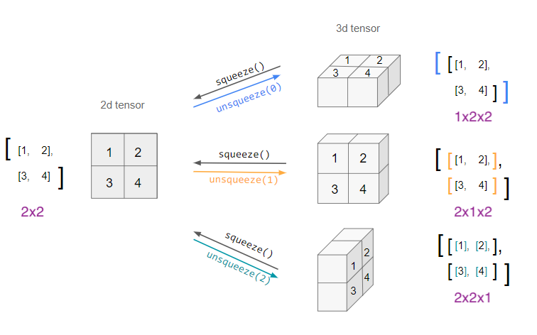

```{python}
#| label: py-setup
#| include: false
import numpy as np
import matplotlib as mpl
import matplotlib.pyplot as plt
import pandas as pd
import seaborn as sns
import warnings

import jax
import jax.numpy as jnp
jax.config.update("jax_enable_x64", True)

import optax

import timeit

import sklearn
sklearn.set_config(display="text")
from sklearn.model_selection import GridSearchCV
from sklearn.linear_model import LinearRegression, Ridge, Lasso

import torch

torch.set_printoptions(
  edgeitems=30, linewidth=200,
  precision = 5
)

plt.rcParams['figure.dpi'] = 200
plt.rcParams['figure.constrained_layout.use'] = True

np.set_printoptions(
  edgeitems=30, linewidth=75,
  precision = 4, suppress=True
  #formatter=dict(float=lambda x: "%.5g" % x)
)

pd.set_option("display.width", 100)
pd.set_option("display.max_columns", 10)
pd.set_option("display.precision", 4)

from scipy import optimize

from pprint import pprint
```

```{r}
#| label: r-setup
#| include: false
#| message: false
#| warning: false


```


## SGD Libraries

Most often you will be using the optimizer methods that come with your tensor library of choice, the following have their own implementations:

* Tensorflow / [Keras](https://keras.io/api/optimizers/)

* [Torch](https://pytorch.org/docs/stable/optim.html)

JAX does not have built-in support for optimization beyond `jax.scipy.optimize.minimize()` (which only supports `BFGS`).

Google previously released [jaxopt](https://github.com/google/jaxopt/) to provide SGD and other optimization methods but this project is now deprecated with the code being merged into DeepMind's [Optax](https://github.com/google-deepmind/optax).


## Optax

::: {.small}
> Optax is a gradient processing and optimization library for JAX.
> 
> Optax is designed to facilitate research by providing building blocks that can be easily recombined in custom ways.
> 
> Our goals are to
> 
> * Provide simple, well-tested, efficient implementations of core components.
> 
> * Improve research productivity by enabling to easily combine low-level ingredients into custom optimizers (or other gradient processing components).
> 
> * Accelerate adoption of new ideas by making it easy for anyone to contribute.
>
> We favor focusing on small composable building blocks that can be effectively combined into custom solutions. Others may build upon these basic components in more complicated abstractions. Whenever reasonable, implementations prioritize readability and structuring code to match standard equations, over code reuse.

```{python}
#| label: optax-version
import optax
optax.__version__
```
:::


## Same regression example

::: {.small}
```{python}
#| label: regression-setup
#| code-line-numbers: "|3|7,8|10-11"
from sklearn.datasets import make_regression
X, y, coef = make_regression(
  n_samples=10000, n_features=20, n_informative=4, 
  bias=3, noise=1, random_state=1234, coef=True
)

X = jnp.c_[jnp.ones(len(y)), X]
n, k = X.shape

def lr_loss(beta, X, y):
  return jnp.sum((y - X @ beta)**2)

lm = LinearRegression(fit_intercept=False).fit(X,y)
lm_loss = lr_loss(lm.coef_, X, y).item()
```
:::


## Optax process {.scrollable}

* Construct a `GradientTransformation` object, set optimizer settings

  ::: {.xsmall}
  ```{python}
  #| label: optax-create-optimizer
  optimizer = optax.sgd(learning_rate=0.0001)
  optimizer
  ```
  :::

* Initialize the optimizer with the initial parameter values

  ::: {.xsmall}
  ```{python}
  #| label: optax-init-optimizer
  beta = jnp.zeros(k)
  opt_state = optimizer.init(beta)
  opt_state
  ```
  :::

* Perform iterations

  * Calculate the current gradient and update for optimizer

    ::: {.xsmall}
    ```{python}
    #| label: optax-update
    f, grad = jax.value_and_grad(lr_loss)(beta, X, y)
    updates, opt_state = optimizer.update(grad, opt_state)
    updates
    opt_state
    ```
    :::

  * Apply the update to the parameter

    ::: {.xsmall}
    ```{python}
    #| label: optax-apply-updates
    beta = optax.apply_updates(beta, updates)
    beta
    ```
    :::


## Example - GD

::: {.panel-tabset} 

### Implementation

::: {.xsmall}
```{python}
#| label: regression-gd
#| code-line-numbers: "|1|3,4|8,9|10"
optimizer = optax.sgd(learning_rate=0.00001)

beta = jnp.zeros(k)
opt_state = optimizer.init(beta)

gd_loss = []
for iter in range(30):
  f, grad = jax.value_and_grad(lr_loss)(beta, X, y)
  updates, opt_state = optimizer.update(grad, opt_state)
  beta = optax.apply_updates(beta, updates)
  gd_loss.append(f)
```


```{python}
#| label: gd-rmse
beta
{ "lm_loss": lm_loss,
  "gd_loss": gd_loss[-1]}
```
:::


### Results

```{python}
#| label: plot-gd-loss
#| echo: false
x = jnp.array(range(len(gd_loss)))
plt.figure()
plt.plot(x, gd_loss, label = "GD")
plt.axhline(y=lm_loss, color="black", linestyle="--", label="sklearn")
plt.yscale("log")
plt.xlabel("epoch")
plt.ylabel("loss")
plt.legend()
plt.show()
```

:::


## Optax and mini batches

While called `sgd()`, the method is really just gradient descent - if you want to do mini-batch, you need to implement the batching yourself.

::: {.xxsmall}
```{python}
#| label: optax-optimize-fn
#| code-line-numbers: "|1|5,6|8-10,13|15-17|3,14,19-22"
def optax_optimize(params, X, y, loss_fn, optimizer, steps=50, batch_size=1, seed=1234):
  n, k = X.shape
  res = {"loss": [], "epoch": np.linspace(0, steps, int(steps*(n/batch_size) + 1))}

  opt_state = optimizer.init(params)
  grad_fn = jax.grad(loss_fn)

  rng = np.random.default_rng(seed)
  batches = np.array(range(n))
  rng.shuffle(batches)

  for iter in range(steps):
    for batch in batches.reshape(-1, batch_size):
      res["loss"].append(loss_fn(params, X, y).item())
      grad = grad_fn(params, X[batch,:], y[batch])
      updates, opt_state = optimizer.update(grad, opt_state)
      params = optax.apply_updates(params, updates)
      
  res["params"] = params
  res["loss"].append(loss_fn(params, X, y).item())

  return(res)
```
:::

## Fitting - SGD - Fixed LR (small)

::: {.panel-tabset}

### Implementation

::: {.xsmall}
```{python}
#| label: sgd-fixed-lr-small
batch_sizes = [10, 100, 1000, 10000]
lrs = [0.00001] * 4

sgd = {
  batch_size: optax_optimize(
    params=jnp.zeros(k), X=X, y=y, loss_fn=lr_loss, 
    optimizer=optax.sgd(learning_rate=lr), 
    steps=30, batch_size=batch_size, seed=1234
  )
  for batch_size, lr in zip(batch_sizes, lrs)
}
```

```{python}
#| label: sgd-fixed-lr-small-loss
#| echo: false

pprint(
  {"lm_loss": lm_loss, **{f"sgd (mb={bs})": sgd[bs]["loss"][-1] for bs in batch_sizes}}
)
```
:::

### Results

```{python}
#| label: plot-sgd-fixed-lr-small
#| echo: false
x = jnp.array(range(len(gd_loss)))
plt.figure()
for batch_size, lr in zip(batch_sizes, lrs):
  plt.plot(sgd[batch_size]["epoch"], sgd[batch_size]["loss"], label = f"SGD (mb={batch_size}, {lr=})")
plt.axhline(y=lm_loss, color="black", linestyle="--", label="sklearn")
plt.yscale("log")
plt.xlabel("epoch")
plt.ylabel("loss")
plt.legend()
plt.show()
```
:::

## Fitting - SGD - Adjusted LR

::: {.panel-tabset}

### Implementation

::: {.xsmall}
```{python}
#| label: sgd-adjusted-lr
batch_sizes = [10, 100, 1000, 10000]
lrs = [0.005, 0.001, 0.0001, 0.00001]

sgd = {
  batch_size: optax_optimize(
    params=jnp.zeros(k), X=X, y=y, loss_fn=lr_loss, 
    optimizer=optax.sgd(learning_rate=lr), 
    steps=30, batch_size=batch_size, seed=1234
  )
  for batch_size, lr in zip(batch_sizes, lrs)
}
```

```{python}
#| label: sgd-adjusted-lr-loss
#| echo: false
pprint(
  {"lm_loss": lm_loss, **{f"sgd (mb={bs})": sgd[bs]["loss"][-1] for bs in batch_sizes}}
)
```
:::

### Full

```{python}
#| label: plot-sgd-adjusted-lr-full
#| echo: false
x = jnp.array(range(len(gd_loss)))
plt.figure()
for batch_size, lr in zip(batch_sizes, lrs):
  plt.plot(sgd[batch_size]["epoch"], sgd[batch_size]["loss"], label = f"SGD (mb={batch_size}, {lr=})")
plt.axhline(y=lm_loss, color="black", linestyle="--", label="sklearn")
plt.yscale("log")
plt.xlabel("epoch")
plt.ylabel("loss")
plt.legend()
plt.show()
```

### Zoom

```{python}
#| label: plot-sgd-adjusted-lr-zoom
#| echo: false
x = jnp.array(range(len(gd_loss)))
plt.figure()
for batch_size in batch_sizes:
  plt.plot(sgd[batch_size]["epoch"], sgd[batch_size]["loss"], label = f"SGD (mb={batch_size})")
plt.axhline(y=lm_loss, color="black", linestyle="--", label="sklearn")
plt.yscale("log")
plt.xlabel("epoch")
plt.ylabel("loss")
l = plt.xlim(0,3)
plt.legend()
plt.show()
```
:::


## Runtime per epoch

::: {.panel-tabset} 

### Implementation

::: {.xsmall}
```{python}
#| label: sgd-runtime
batch_sizes = [10, 100, 1000, 10000]
lrs = [0.005, 0.001, 0.0001, 0.00001]

sgd_runtime = {
  batch_size: timeit.Timer( lambda:
    optax_optimize(
      params=jnp.zeros(k), X=X, y=y, loss_fn=lr_loss, 
      optimizer=optax.sgd(learning_rate=lr), 
      steps=1, batch_size=batch_size, seed=1234
    )
  ).repeat(5,1)
  for batch_size, lr in zip(batch_sizes, lrs)
}
```
:::

### Runtimes

```{python}
#| label: plot-sgd-runtime
#| echo: false
res = pd.DataFrame(sgd_runtime).melt(
  value_name="time", var_name="batch_size"
).merge(
  pd.DataFrame({"batch_size": [10, 100, 1000, 10000], "scaler": [0.05,0.3,2.5,25]})
).assign(
  batch_size = lambda x: x.batch_size.astype(str),
  full_time = lambda x: x.time * x.scaler
)

g = sns.catplot(
  res, x="batch_size", y="time", aspect=1.5
).set(
  title="Runtime per epoch", ylabel="time (sec)"
)
g.figure.set_layout_engine("constrained")
```

### Scaled

```{python}
#| label: plot-sgd-runtime-scaled
#| echo: false
g = sns.catplot(
  res, x="batch_size", y="full_time", aspect=1.5
).set(
  title="Runtime to convergence", ylabel="time (sec)"
)
g.figure.set_layout_engine("constrained")
```
:::


## Some general comments

* Batch size determines both training time and computing resources

* Generally there should be an inverse relationship between learning rate and batch size

* Most optimizer hyperparameters are sensitive to batch size

* For really large models batches are a necessity and sizing is often determined by resource / memory constraints


# Adam 

## Adam - Fixed LR

::: {.panel-tabset}

### Implementation

::: {.xsmall}
```{python}
#| label: adam-fixed-lr
batch_sizes = [10, 25, 50, 100]
lrs = [1]*4

adam = {
  batch_size: optax_optimize(
    params=jnp.zeros(k), X=X, y=y, loss_fn=lr_loss, 
    optimizer=optax.adam(learning_rate=lr, b1=0.9, b2=0.999, eps=1e-8),
    steps=2, batch_size=batch_size, seed=1234
  )
  for batch_size, lr in zip(batch_sizes, lrs)
}
```

```{python}
#| label: adam-fixed-lr-loss
#| echo: false
pprint(
  {"lm_loss": lm_loss, **{f"adam (mb={bs})": adam[bs]["loss"][-1] for bs in batch_sizes}}
)
```
:::


### Results

```{python}
#| label: plot-adam-fixed-lr
#| echo: false
plt.figure()
for batch_size, lr in zip(batch_sizes, lrs):
  plt.plot(adam[batch_size]["epoch"], adam[batch_size]["loss"], label = f"Adam (mb={batch_size}, {lr=})")
plt.axhline(y=lm_loss, color="black", linestyle="--", label="sklearn")
plt.yscale("log")
plt.xlabel("epoch")
plt.ylabel("loss")
plt.legend()
plt.show()
```

:::


## Adam - Smaller Fixed LR

::: {.panel-tabset}

### Implementation

::: {.xsmall}
```{python}
#| label: adam-smaller-lr
batch_sizes = [10, 25, 50, 100]
lrs = [0.1]*4

adam = {
  batch_size: optax_optimize(
    params=jnp.zeros(k), X=X, y=y, loss_fn=lr_loss, 
    optimizer=optax.adam(learning_rate=lr, b1=0.9, b2=0.999, eps=1e-8),
    steps=10, batch_size=batch_size, seed=1234
  )
  for batch_size, lr in zip(batch_sizes, lrs)
}
```

```{python}
#| label: adam-smaller-lr-loss
#| echo: false
pprint(
  {"lm_loss": lm_loss, **{f"adam (mb={bs})": adam[bs]["loss"][-1] for bs in batch_sizes}}
)
```
:::


### Results

```{python}
#| label: plot-adam-smaller-lr
#| echo: false
plt.figure()
for batch_size, lr in zip(batch_sizes, lrs):
  plt.plot(adam[batch_size]["epoch"], adam[batch_size]["loss"], label = f"Adam (mb={batch_size}, {lr=})")
plt.axhline(y=lm_loss, color="black", linestyle="--", label="sklearn")
plt.yscale("log")
plt.xlabel("epoch")
plt.ylabel("loss")
plt.legend()
plt.show()
```

:::


## Learning rate schedules

As mentioned last time, most gradient-based methods are not guaranteed to converge unless their learning rates decay as a function of step number.

Some of the methods make this issue worse (e.g. Adam)

. . .

<br/>

Optax supports a [large number](https://optax.readthedocs.io/en/latest/api/optimizer_schedules.html) of pre-built learning rate schedules which can be passed into any of its optimizers instead of a fixed floating point value.

::: {.xsmall}
```{python}
#| label: lr-schedule
schedule = optax.linear_schedule(
    init_value=1., end_value=0., transition_steps=5
)

[schedule(step).item() for step in range(6)]
```
:::


## Adam w/ Exp Decay

::: {.panel-tabset}

### Implementation

::: {.xxsmall}
```{python}
#| label: adam-exp-decay
batch_sizes = [10, 25, 50, 100]

adam = {
  batch_size: optax_optimize(
    params=jnp.zeros(k), X=X, y=y, loss_fn=lr_loss,
    optimizer=optax.adam(
      learning_rate=optax.schedules.exponential_decay(
        init_value=1,
        transition_steps=100, 
        decay_rate=0.9
      ),
      b1=0.9, b2=0.999, eps=1e-8
    ),
    steps=2, batch_size=batch_size, seed=1234
  )
  for batch_size in batch_sizes
}
```

```{python}
#| label: adam-exp-decay-loss
#| echo: false
pprint(
  {"lm_loss": lm_loss, **{f"adam (mb={bs})": adam[bs]["loss"][-1] for bs in batch_sizes}}
)
```
:::


### Results

```{python}
#| label: plot-adam-exp-decay
#| echo: false
plt.figure()
for batch_size in batch_sizes:
  plt.plot(adam[batch_size]["epoch"], adam[batch_size]["loss"], label = f"Adam (mb={batch_size})")
plt.axhline(y=lm_loss, color="black", linestyle="--", label="sklearn")
plt.yscale("log")
plt.xlabel("epoch")
plt.ylabel("loss")
plt.legend()
plt.show()
```

:::


## Runtime per epoch

::: {.panel-tabset} 

### Implementation

::: {.xsmall}
```{python}
#| label: adam-runtime
batch_sizes = [10, 25, 50, 100]

adam_runtime = {
  batch_size: timeit.Timer( lambda:
    optax_optimize(
      params=jnp.zeros(k), X=X, y=y, loss_fn=lr_loss, 
      optimizer=optax.adam(
        learning_rate=optax.schedules.exponential_decay(
          init_value=1,
          transition_steps=100, 
          decay_rate=0.9
        ),
        b1=0.9, b2=0.999, eps=1e-8
      ),
      steps=1, batch_size=batch_size, seed=1234
    )
  ).repeat(5,1)
  for batch_size in batch_sizes
}
```
:::

### Runtimes

```{python}
#| label: plot-adam-runtime
#| echo: false
res = pd.DataFrame(adam_runtime).melt(
  value_name="time", var_name="batch_size"
).merge(
  pd.DataFrame({"batch_size": [10, 25, 50, 100], "scaler": [0.18,0.3,0.63,1.4]})
).assign(
  batch_size = lambda x: x.batch_size.astype(str),
  full_time = lambda x: x.time * x.scaler
)

g = sns.catplot(
  res, x="batch_size", y="time", aspect=1.5
).set(
  title="Runtime per epoch", ylabel="time (sec)"
)
g.figure.set_layout_engine("constrained")
```

### Scaled

```{python}
#| label: plot-adam-runtime-scaled
#| echo: false
g = sns.catplot(
  res, x="batch_size", y="full_time", aspect=1.5
).set(
  title="Runtime to convergence", ylabel="time (sec)"
)
g.figure.set_layout_engine("constrained")
```
:::


## Some advice ... {.smaller}

The following is from Google Research's [Tuning Playbook](https://github.com/google-research/tuning_playbook?tab=readme-ov-file#choosing-the-optimizer):

> * No optimizer is the "best" across all types of machine learning problems and model architectures. Even just comparing the performance of optimizers is a difficult task. 🤖
>
> * We recommend sticking with well-established, popular optimizers, especially when starting a new project.
>   * Ideally, choose the most popular optimizer used for the same type of problem.
>
> * Be prepared to give attention to *all* hyperparameters of the chosen optimizer.
>   * Optimizers with more hyperparameters may require more tuning effort to find the best configuration.
>   * This is particularly relevant in the beginning stages of a project when we are trying to find the best values of various other hyperparameters (e.g. architecture hyperparameters) while treating optimizer hyperparameters as nuisance parameters.
>   * It may be preferable to start with a simpler optimizer (e.g. SGD with fixed momentum or Adam with fixed $\epsilon$, $\beta_1$, and $\beta_2$) in the initial stages of the project and switch to a more general optimizer later.
>
> * Well-established optimizers that we like include (but are not limited to):
>   * SGD with momentum (we like the Nesterov variant)
>   * Adam and NAdam, which are more general than SGD with momentum. Note that Adam has 4 tunable hyperparameters and they can all matter!

# Torch

## PyTorch

> PyTorch is a Python package that provides two high-level features:
>
> * Tensor computation (like NumPy) with strong GPU acceleration
> * Deep neural networks built on a tape-based autograd system

. . .

::: {.small}
```{python}
#| label: torch-version
import torch
torch.__version__
```
:::

## Tensors

are the basic data abstraction in PyTorch and are implemented by the `torch.Tensor` class. They behave in much the same way as the other array libraries we've seen so far (`numpy`, `jax`, etc.) - including the same broadcasting rules.

:::: {.columns .small}
::: {.column width='50%'}
```{python}
#| label: torch-constructors
torch.zeros(3)
torch.ones(3,2)
torch.empty(2,2,2)
```
:::

::: {.column width='50%'}
```{python}
#| label: torch-rand
torch.manual_seed(1234)
torch.rand(2,2,2,2)
```
:::
::::


## NumPy conversion

It is possible to easily move between NumPy arrays and Tensors via the `from_numpy()` function and `numpy()` method.

::: {.xsmall}
```{python}
#| label: numpy-conversion
a = np.eye(3,3)
torch.from_numpy(a)

b = np.array([1,2,3])
torch.from_numpy(b)

c = torch.rand(2,3)
c.numpy()

d = torch.ones(2,2, dtype=torch.int64)
d.numpy()
```
:::

## Inplace modification

Many functions have an inplace variant (indicated by a `_` suffix) that modifies the tensor rather than creating a new one. This includes both math functions and arithmetic operators.

:::: {.columns .xxsmall}
::: {.column width='50%'}
```{python}
#| label: torch-exp
a = torch.rand(2,2)
print(torch.exp(a))
print(a)
```

```{python}
#| label: torch-exp-inplace
print(torch.exp_(a))
print(a)
```
:::

::: {.column width='50%' .fragment}
```{python}
#| label: torch-add
a = torch.ones(2, 2)
b = torch.rand(2, 2)
a+b
print(a)
```

```{python}
#| label: torch-add-inplace
a.add_(b)
print(a)
```
:::
::::

::: {.aside}
For functions without a `_` variant, check if they have an `out` argument which can be used instead - e.g. see `torch.matmul()`
:::


## Changing tensor shapes

The `shape` of a tensor can be changed using the `view()` or `reshape()` methods. The former guarantees that the result shares data with the original object (but requires contiguity), the latter may or may not copy the data.

:::: {.columns .xsmall}
::: {.column width='33.3%'}
```{python}
#| label: torch-view
x = torch.zeros(3, 2)
y = x.view(2, 3)
```
```{python}
#| label: torch-view-share
y
x.fill_(1)
y
```
:::

::: {.column width='33.3%'}
```{python}
#| label: torch-transpose
x = torch.zeros(3, 2)
y = x.t()
```
```{python}
#| label: torch-view-contiguous
#| error: true
x.view(6)
y.view(6)
```
:::

::: {.column width='33.3%'}
```{python error=TRUE}
#| label: torch-reshape
z = y.reshape(6)
x.fill_(1)
y
z
```
:::
::::


## Adding or removing dimensions

The `squeeze()` and `unsqueeze()` methods can be used to remove or add length 1 dimension(s) to a tensor.

{fig-align="center" width="80%"}

::: {.aside}
From stackoverflow [post](https://stackoverflow.com/questions/57237352/what-does-unsqueeze-do-in-pytorch) by iacob
:::


## Exercise 1

Given the following tensors, 

```{python}
#| label: exercise-tensors
a = torch.ones(4,3,2)
b = torch.rand(3)
c = torch.rand(5,3)
```

what reshaping is needed to make it possible so that `a * b`, `a * c`, and `b * c` can be calculated via broadcasting?

```{r}
#| echo: false
countdown::countdown(3)
```


# Autograd

## Autograd vs JAX

PyTorch's autograd takes a fundamentally different approach from JAX:

* JAX - functional: `jax.grad(f)` returns a *new function* that computes the gradient. No state is mutated.

* PyTorch - stateful: tensors record operations into a computational graph, then `.backward()` populates `.grad` attributes on leaf tensors.

This means PyTorch gradients accumulate by default — you must manually zero them between steps (via `grad = None` or `optimizer.zero_grad()`), a common source of bugs.

##

:::: {.columns}
::: {.column width='50%'}

JAX

::: {.small}
```{python}
#| label: jax-grad
def f(x):
  return jnp.sum(3*x + 2)

x = jnp.linspace(0, 2, 21)
jax.grad(f)(x)
```
:::
:::

::: {.column width='50%'}
PyTorch

::: {.small}
```{python}
#| label: torch-grad
x = torch.linspace(
  0, 2, steps=21, requires_grad=True
)
y = (3*x + 2).sum()

y.backward()
x.grad
```
:::

:::
::::


## Tensor expressions

Gradient tracking can be enabled using the `requires_grad` argument at initialization, alternatively the `requires_grad` flag can be set on the tensor or the `enable_grad()` context manager used (via `with`).

::: {.small}
```{python}
#| label: torch-requires-grad
x = torch.linspace(0, 2, steps=21, requires_grad=True)
x
```
:::

. . .

::: {.small}
```{python}
#| label: torch-expression
y = 3*x + 2
y
```
:::


## Computational graph

Basics of the computation graph can be explored via the `next_functions` attribute

::: {.small}
```{python}
#| label: torch-comp-graph
y.grad_fn
y.grad_fn.next_functions
y.grad_fn.next_functions[0][0].next_functions
y.grad_fn.next_functions[0][0].next_functions[0][0].next_functions
```
:::


## Autogradient

In order to calculate the gradients we use the `backward()` method on the *output* tensor (must be a scalar), this then makes the grad attribute available for the input (leaf) tensors.

::: {.small}
```{python}
#| label: torch-backward
out = y.sum()
out.backward()
out
```
:::

. . .

::: {.small}
```{python}
#| label: torch-y-grad
y.grad
```
:::

. . .

::: {.small}
```{python}
#| label: torch-x-grad
x.grad
```
:::


## A bit more complex

::: {.small}
```{python}
#| label: torch-complex-grad
n = 21
x = torch.linspace(0, 2, steps=n, requires_grad=True)
m = torch.rand(n, requires_grad=True)

y = m*x + 2

y.backward(torch.ones(n))
```
:::

. . .

::: {.small}
```{python}
#| label: torch-complex-x-grad
x.grad
```
:::

::: {.small}
```{python}
#| label: torch-complex-m-grad
m.grad
```
:::

. . .

In context you can interpret `x.grad` and `m.grad` as the gradient of `y` with respect to `x` or `m` respectively.


## High-level autograd API

allows for the automatic calculation and evaluation of the jacobian and hessian for a function defined using tensors.

::: {.small}
```{python}
#| label: autograd-fn
def f(x, y):
  return 3*x + 1 + 2*y**2 + x*y
```
:::


::: {.small}
```{python}
#| label: autograd-jacobian
for x in [0.,1.]:
  for y in [0.,1.]:
    print("x =",x, "y = ",y)
    inputs = (torch.tensor([x]), torch.tensor([y]))
    print(torch.autograd.functional.jacobian(f, inputs),"\n")
```
:::

##

::: {.small}
```{python}
#| label: autograd-hessian
inputs = (torch.tensor([0.]), torch.tensor([0.]))
torch.autograd.functional.hessian(f, inputs)

inputs = (torch.tensor([1.]), torch.tensor([1.]))
torch.autograd.functional.hessian(f, inputs)
```
:::


# Demo 1 - Linear Regression<br/>w/ PyTorch

```{python}
#| label: regression-setup-again
#| include: false
from sklearn.datasets import make_regression
X, y, coef = make_regression(
  n_samples=10000, n_features=20, n_informative=4, 
  bias=3, noise=1, random_state=1234, coef=True
)

X = jnp.c_[jnp.ones(len(y)), X]
n, k = X.shape

def lr_loss(beta, X, y):
  return jnp.sum((y - X @ beta)**2)

lm = LinearRegression(fit_intercept=False).fit(X,y)
lm_loss = lr_loss(lm.coef_, X, y).item()
```

## Same regression example (again)

::: {.xsmall}
```{python}
#| label: torch-regression-setup
Xt = torch.from_numpy(np.array(X))
yt = torch.from_numpy(np.array(y))
n, k = Xt.shape

bt = torch.zeros(k, dtype=torch.float64, requires_grad=True)
```

```{python}
#| label: torch-regression-shapes
Xt.shape
yt.shape
bt.shape
```
:::

. . .

::: {.xsmall}
```{python}
#| label: torch-predict
yt_pred = Xt @ bt
```
:::

. . .

::: {.xsmall}
```{python}
#| label: torch-loss
loss = (yt_pred - yt).pow(2).sum()
loss.item()
```
:::


## Gradient descent


::: {.small}
```{python}
#| label: torch-gd-step
learning_rate = 1e-5

loss.backward() # Compute the backward pass

with torch.no_grad():
  bt -= learning_rate * bt.grad # Make the step

  bt.grad = None # Reset the gradients
```
:::

::: {.aside}
`torch.no_grad()` disables gradient tracking within the context — necessary here because in-place updates to `bt` would otherwise be recorded in the computation graph, causing errors.
:::

. . .

::: {.small}
```{python}
#| label: torch-loss-after-step
yt_pred = Xt @ bt
loss = (yt_pred - yt).pow(2).sum()
loss.item()
```
:::


## Putting it together

::: {.xsmall}
```{python}
#| label: torch-gd-loop
#| output-location: slide
bt = torch.zeros(k, dtype=torch.float64, requires_grad=True)

learning_rate = 1e-5
for i in range(101):

  yt_pred = Xt @ bt

  loss = (yt_pred - yt).pow(2).sum()
  if i % 10 == 0:
    print(f"Step: {i},\tloss: {loss.item():.4f}")

  loss.backward()

  with torch.no_grad():
    bt -= learning_rate * bt.grad
    bt.grad = None
```
:::


## Comparing results

:::: {.columns .xsmall}
::: {.column width='50%'}
```{python}
#| label: lm-params
lm.coef_
```
:::

::: {.column width='50%'}
```{python}
#| label: bt-params
bt.detach().numpy()
```
:::
::::

::: {.small}
```{python}
#| label: torch-loss-compare
#| echo: false
pprint(
  { "lm_loss": lm_loss,
  "torch_loss": (Xt @ bt - yt).pow(2).sum().item() }
)
```
:::

::: {.aside}
Note - `bt.detach()` is needed here to obtain a tensor detached from the computation graph (e.g. for converting to NumPy).
:::

# Demo 2 - Using a torch model

## A simple model

::: {.xsmall}
```{python}
#| label: torch-model-class
class Model(torch.nn.Module):
    def __init__(self, beta):
        super().__init__()
        beta.requires_grad = True
        self.beta = torch.nn.Parameter(beta)

    def forward(self, X):
        return X @ self.beta

def training_loop(model, X, y, optimizer, n=100):
    losses = []
    for i in range(n):
        y_pred = model(X)

        loss = (y_pred - y).pow(2).sum()
        loss.backward()

        optimizer.step()
        optimizer.zero_grad()

        losses.append(loss.item())

    return losses
```
:::


## Fitting

::: {.xsmall}
```{python}
#| label: torch-model-fit
m = Model(beta = torch.zeros(k, dtype=torch.float64))
opt = torch.optim.SGD(m.parameters(), lr=1e-5)

losses = training_loop(m, Xt, yt, opt, n=100)
```
:::


## Results

::: {.xsmall}
```{python}
#| label: torch-model-beta
m.beta
pprint(
  { "lm_loss": lm_loss,
    "torch_loss": losses[-1] }
)
```
:::


```{python}
#| label: plot-torch-model-losses
#| echo: false
plt.figure(figsize=(8,6), layout="constrained")
plt.plot(losses)
plt.axhline(y=lm_loss, color="black", linestyle="--", label="sklearn")
plt.yscale("log")
plt.xlabel("step")
plt.ylabel("loss")
plt.legend()
plt.show()
```


## An all-in-one model

::: {.small}
```{python}
#| label: torch-model-allinone
class Model(torch.nn.Module):
    def __init__(self, k, beta=None):
        super().__init__()
        if beta is None:
          beta = torch.zeros(k, dtype=torch.float64)
        beta.requires_grad = True
        self.beta = torch.nn.Parameter(beta)

    def forward(self, X):
        return X @ self.beta

    def fit(self, X, y, opt, n=100):
      losses = []
      for i in range(n):
          loss = (self.forward(X) - y).pow(2).sum()
          loss.backward()
          opt.step()
          opt.zero_grad()
          losses.append(loss.item())

      return losses
```
:::

## Learning rate and convergence

::: {.small}
```{python}
#| label: plot-lr-convergence
#| echo: false
plt.figure(figsize=(8,6), layout="constrained")

for lr in [1e-4, 1e-5, 1e-6, 1e-7]:
  m = Model(k)
  opt = torch.optim.SGD(m.parameters(), lr=lr)
  losses = m.fit(Xt, yt, opt, n=100)

  plt.plot(losses, label=f"{lr=}")

plt.axhline(y=lm_loss, color="black", linestyle="--", label="sklearn")
plt.yscale("log")
plt.legend()
plt.show()
```
:::


## What about mini-batches & LR?

All of the torch examples so far have used "full-batch" gradient descent. In the next lecture we will cover:

* Mini-batch training via `DataLoader` and `Dataset` classes

* Learning rate schedulers via `lr_scheduler`

* Other optimizers via `torch.optim` (e.g. Adam, RMSProp, etc.)
